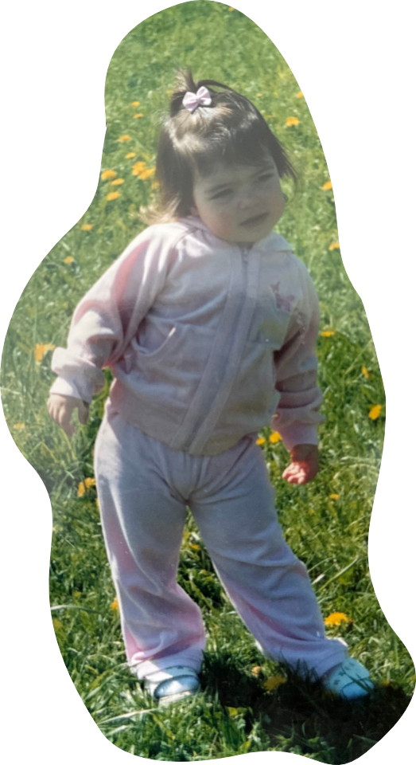
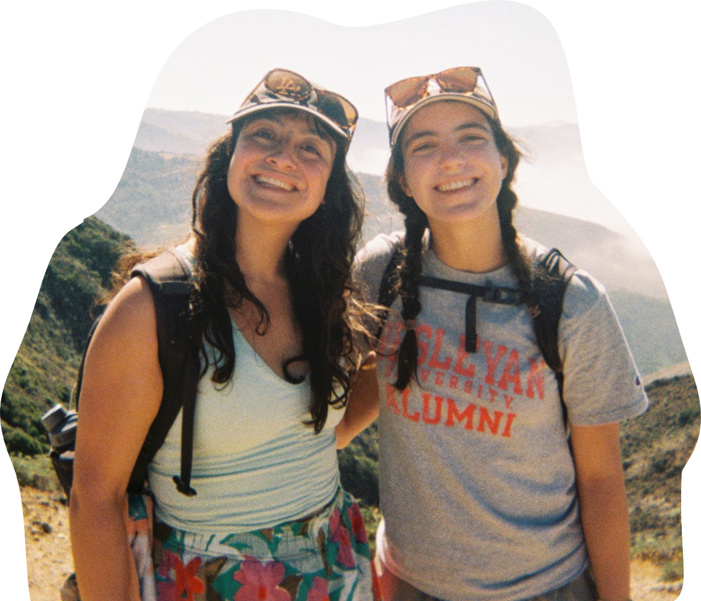
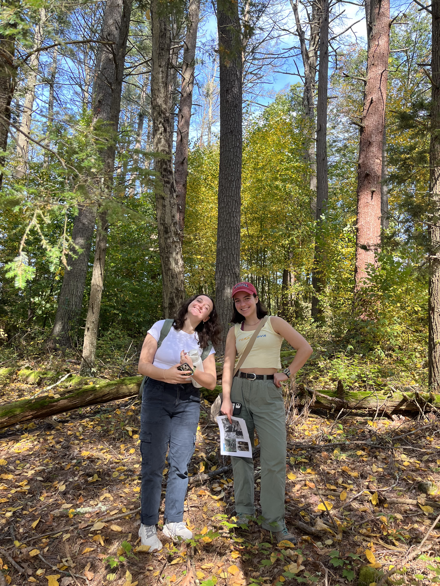
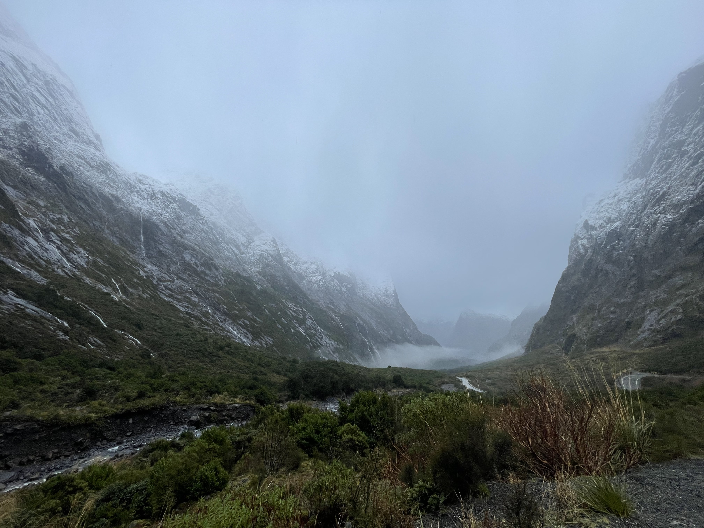
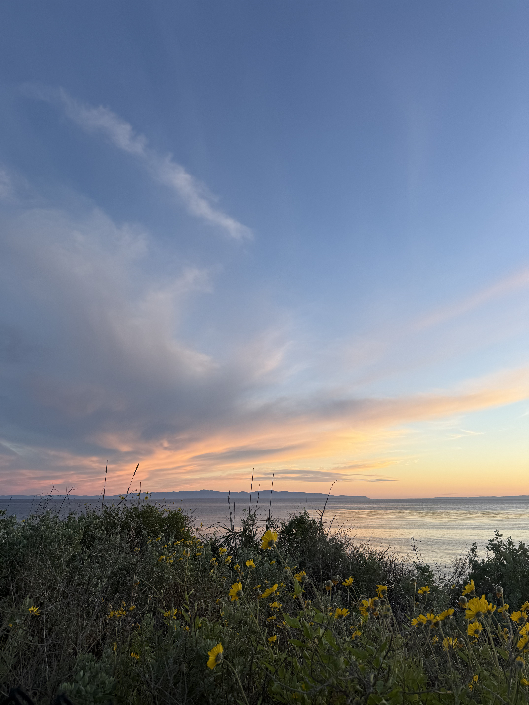
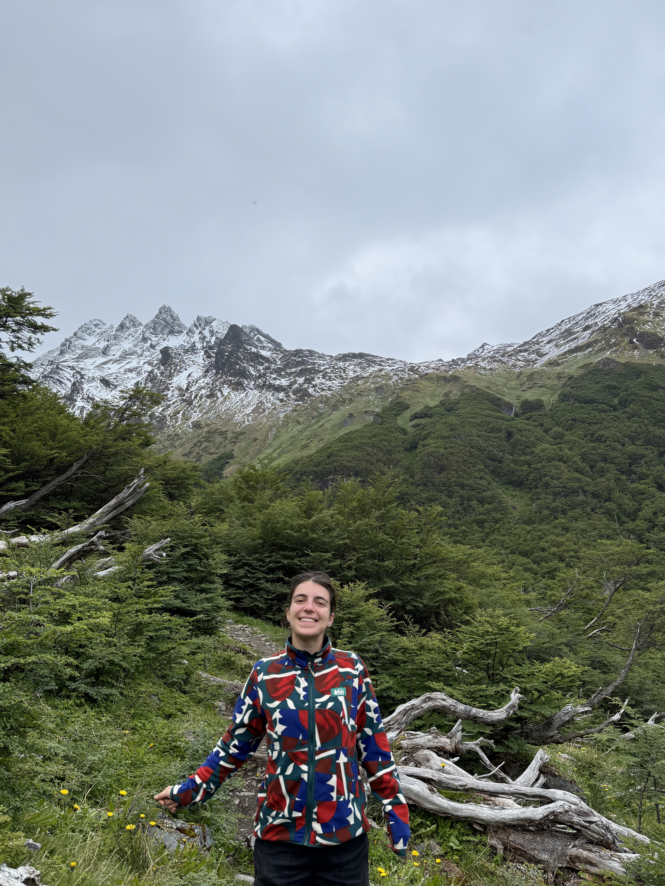

<style>
#imageCarousel {
  height: 650px;
  width: 100%;
}

#imageCarousel .carousel-inner,
#imageCarousel .carousel-item {
  height: 100%;
}

#imageCarousel .carousel-item img {
  height: 100%;
  width: 100%;
  object-fit: cover;  
}

.carousel-caption {
  right: 5%;
  left: auto;
  text-align: right;
  bottom: 5px;
  max-width: 90%;
}

@media (max-width: 850px) {
  .columns {
    flex-direction: column;
  }
  .column {
    width: 100% !important;
  }
}

</style>

:::: {layout="[80,20]"}

::: {#first-column}

I can't actually pinpoint the moment that drove me to care for the health of the environment and communities. Often environmental scientists have tales of childhoods spent outside — and although I did spend a lot of time outside — my desire to study and work in the environmental field didn’t come around until college. 

<br>

I started at Wesleyan University with a dream to be a journalist (after a childhood of English being my best subject), but that idea was squashed when I realized that I did not care for my introductory government class. In my attempt to explore all potential paths (bless Wesleyan’s open curriculum), I took a class on renewable energy, and that’s what ended up sticking. 

<br>

In undergrad I took courses in soils, geobiology, sedimentology, planetary evolution, studied abroad on the Galápagos Islands and in New Zealand, and did a capstone project on ant species in Puerto Rico (see the photo gallery below!). Truly the most enriching parts of my education were all of the afternoons I spent in the field, learning how the world works. 

:::
::: {#second-column}
```{r}
#| eval: true
#| echo: false
#| fig-align: "center"
#| out-width: "70%"
#| fig-alt: "Me as a kid in Riga!"

```
<p style="color: #396845ff; font-size: 12px;">Me (rocking a pretty awesome tracksuit) outside in Riga, Latvia. </p>

:::

::::

:::: {layout="[20,80]"}

::: {#first-column}

```{r}
#| eval: true
#| echo: false
#| fig-align: "center"
#| out-width: "100%"
#| fig-alt: "One of my MEDS capstone team members - also named Sofia - and I on a cohort hike on the Channel Islands!"

```
<p style="color: #396845ff; font-size: 12px;">Me and one of my MEDS capstone team members - also named Sofia - on a cohort hike on the Channel Islands!</p>

:::
::: {#second-column}

At the same time, I was also completing an economics major — learning about statistical methods and the science of choice. It felt pragmatic, another way of making sense of the world. The major was also my first introduction to coding, as I got to learn Stata, a statistical software which, in the economics field, is used as often as R. 

<br>

After finishing my Bachelor’s degree, I — perhaps in an attempt to delay the job search — shipped out to California to pursue a Master of Environmental Data Science at UCSB. I hoped this intersection of environment and economics is where I could belong. Turns out, I love it! Though I still cherish getting my hands dirty and my feet wet, the satisfaction of your code finally running properly after hours of tinkering is hard to beat.

:::

::::


So, my love for walkable cities could come from my first few years of life (and many summers after that) spent living in Riga, Latvia’s capital city. My excitement for plants and animals and clean air and oceans could come from always living near a coast, or being surrounded by the green of the American, northeastern suburbs. I don’t know. But I do know that I love it all, and I want to use both my passion and skills to help make this world run cleaner for the communities — human or not — that inhabit it. 

:::: {layout="[60,40]"}

::: {#first-column}

<br>
<br>
<br>
<br>
<br>
[Come back soon to see more content here!]

:::
::: {#second-column}

### Photo Gallery

```{=html}
<!-- thank you to avarobillard.github.io for inspring this code! -->


<div id="imageCarousel" class="carousel slide" data-bs-wrap="false">
  <div class="carousel-inner">
    
    <!-- Image 1 -->
    <div class="carousel-item active">
      
     
     <!-- Image 1 caption --> 
      <div class="carousel-caption d-none d-md-block">
    <p>My good friend Emma and I on a Soils field trip at Wesleyan (October 2023).</p>
    
    <!-- end caption div --> 
  </div>
  
   <!-- end Image 1 div --> 
    </div>
    
    <!-- Image 2 -->
    <div class="carousel-item">
      
      
       <!-- Image 2 caption --> 
      <div class="carousel-caption d-none d-md-block">
    <p>A Galápagos sea lion on the island of San Cristobal (where I studied abroad in January 2024).</p>
    
    <!-- end caption div --> 
  </div>
      
      <!--end Image 2 div-->
    </div>
    
     <!-- Image 3 -->
    <div class="carousel-item">
      
      
       <!-- Image 3 caption --> 
      <div class="carousel-caption d-none d-md-block">
    <p>Me facing off with a Galápagos Giant Tortoise at the island's national park.</p>
    
    <!-- end caption div --> 
  </div>
      
      <!--end Image 3 div-->
    </div>
    
    <!-- Image 4 -->
    <div class="carousel-item">
      
   
   <!-- Image 4 caption --> 
      <div class="carousel-caption d-none d-md-block">
    <p>Incredible New Zealand! This is near Fiordland National Park.</p>
    
    <!-- end caption div --> 
  </div>
    
    <!--end Image 4 div-->
    </div>
    
    <!-- Image 5 -->
    <div class="carousel-item">
      
   
   <!-- Image 5 caption --> 
      <div class="carousel-caption d-none d-md-block">
    <p>Enjoying Santa Barbara's beautiful beaches and sunsets.</p>
    
    <!-- end caption div --> 
  </div>
    
    <!--end Image 5 div-->
    </div>
    
     <!-- Image 6 -->
    <div class="carousel-item">
      
   
   <!-- Image 6 caption --> 
      <div class="carousel-caption d-none d-md-block">
    <p style="color: white; text-align: left;">Me with Los Cincos Hermanos in the background - Patagonia, Argentina (December 2025).</p>
    
    <!-- end caption div --> 
  </div>
    
    <!--end Image 6 div-->
    </div>
    
  </div>
  
  <!-- Left arrow (Previous) -->
  <button class="carousel-control-prev" type="button" data-bs-target="#imageCarousel" data-bs-slide="prev">
    <span class="carousel-control-prev-icon" aria-hidden="true"></span>
    <span class="visually-hidden">Previous</span>
  </button>
  
  <!-- Right arrow (Next) -->
  <button class="carousel-control-next" type="button" data-bs-target="#imageCarousel" data-bs-slide="next">
    <span class="carousel-control-next-icon" aria-hidden="true"></span>
    <span class="visually-hidden">Next</span>
  </button>
</div>
```

:::

::::