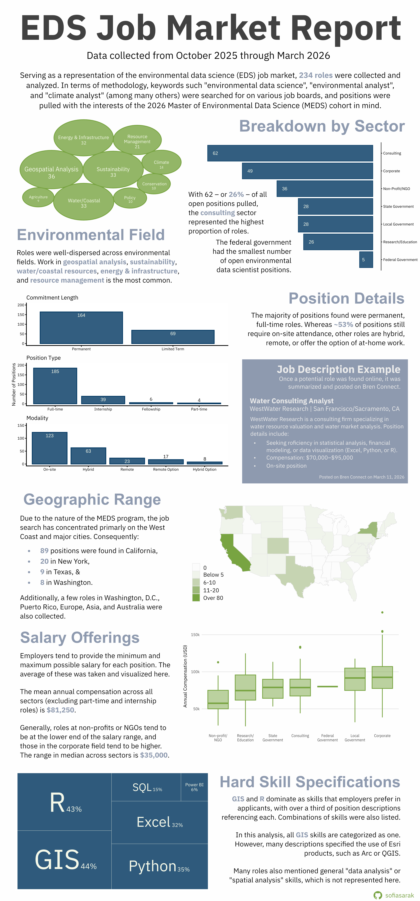
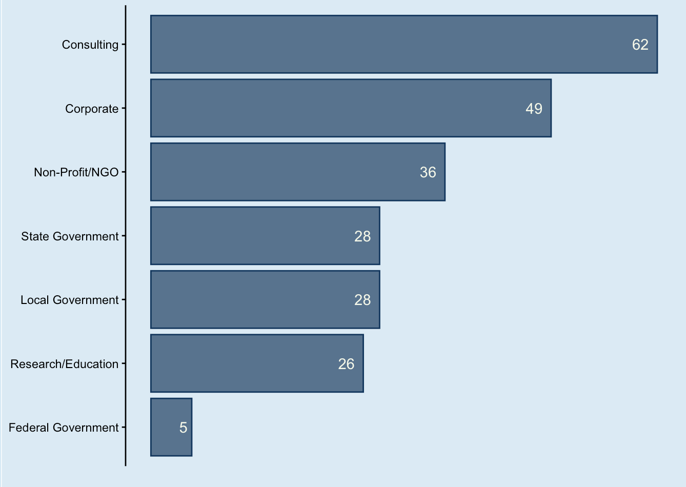
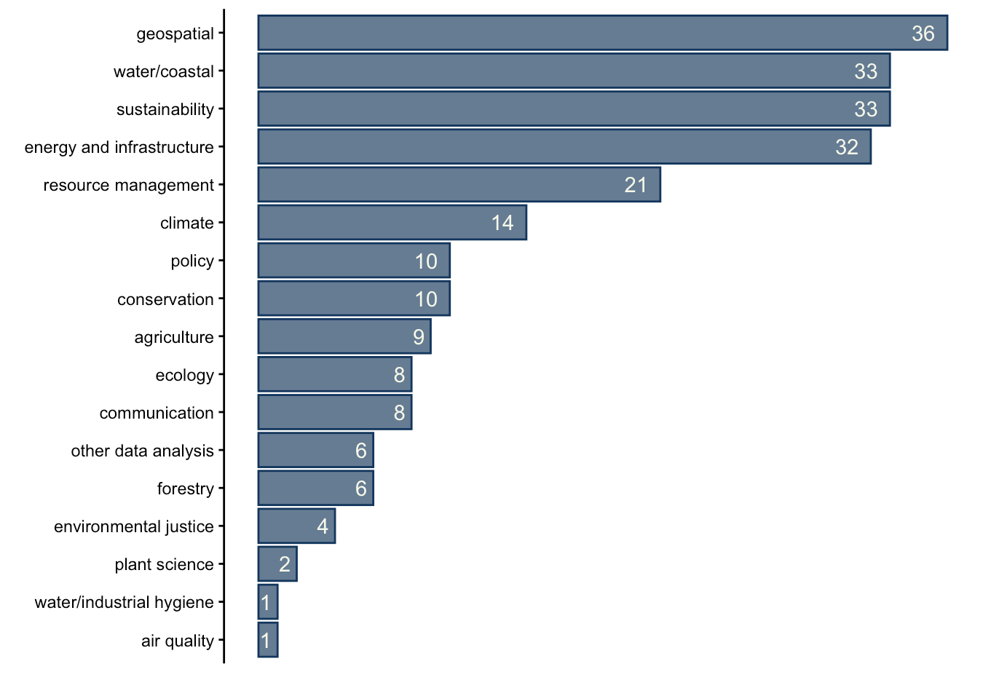
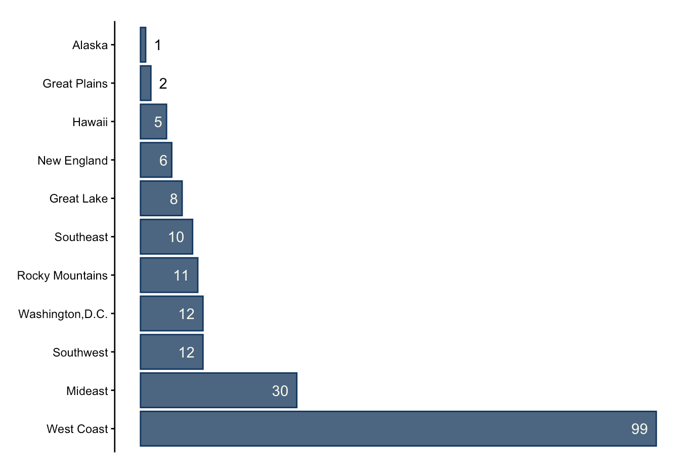
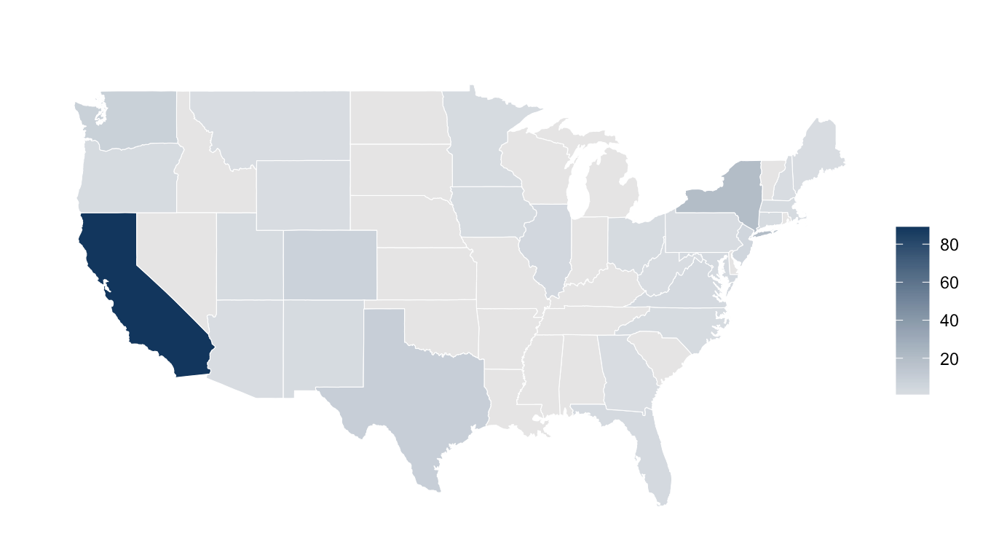
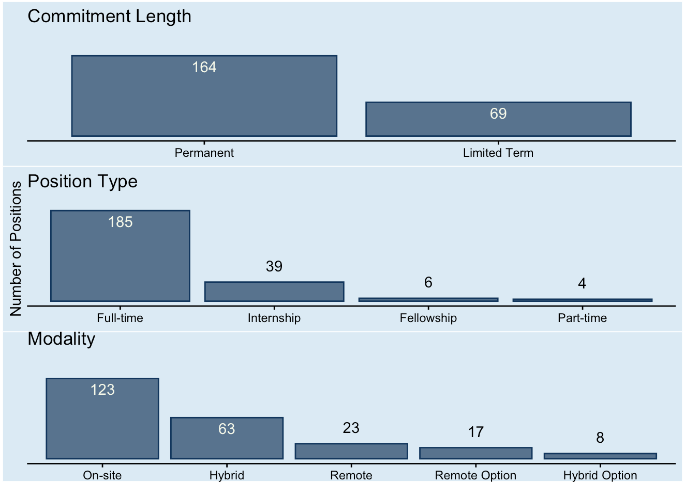
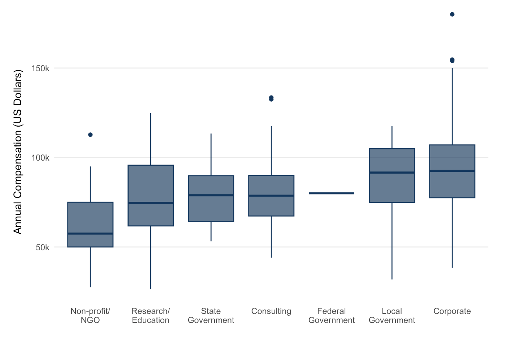
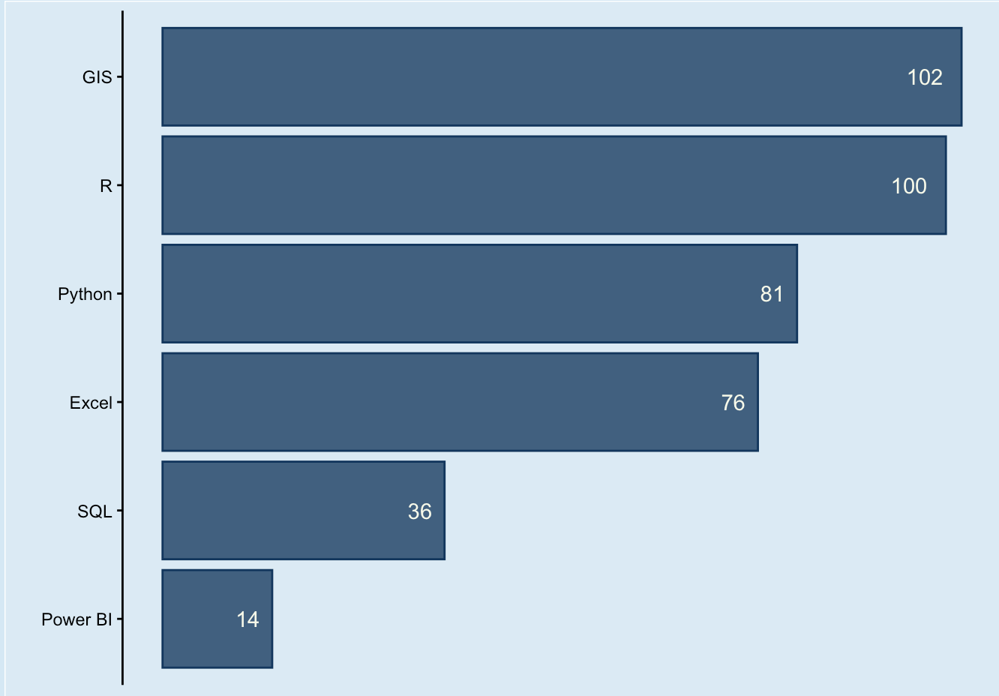
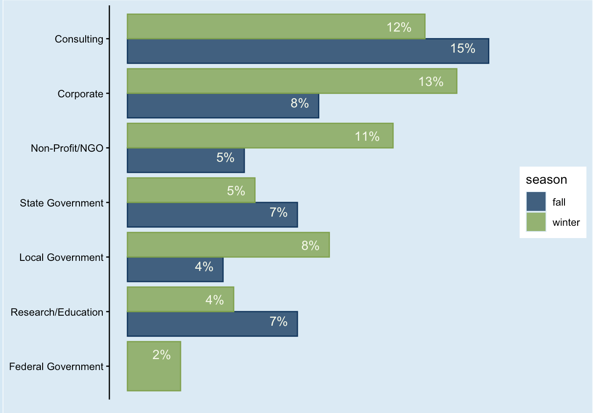
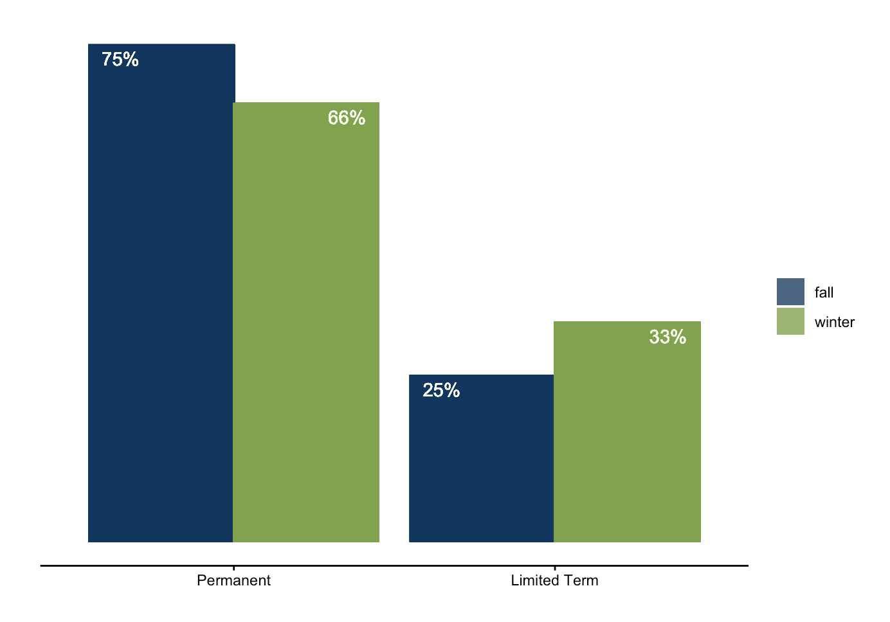

# Introduction

Alongside being a full-time Master's student, I work part-time as the Student Assistant for the [Bren School's Career Development Team](https://bren.ucsb.edu/career-services). I primarily search for open environmental data science positions, which I repost to the Bren School's networking platform -- kind of like an internal LinkedIn. 

It has been really fun to see what sorts of roles are out there, and has even helped me in my own job search, too.
I also find it incredibly rewarding to help out my classmates (hopefully making their job searches easier) and work with my supervisor, Miya. In addition to crafting job posts, I collect data on the roles I find, creating an environmental data science job dataset that's ready for analysis. 

I use this dataset to compile an environmental data science (EDS) job market report every quarter. I completed one for the fall, and am now on the winter rendition. In this blog post, I include two formats of my EDS job market review: an infographic and a written summary. I was inspired to make the infographic after taking a data visualization course in the winter quarter and having to [make my own](https://sofiasarak.github.io/blog/ukrainian-sunflowers-infographic/) for the final project. The written summary, on the other hand, is a more useful format for the career and curriculum teams at Bren.

Both forms of the report are included in this blog post -- I will let them speak for themselves, rather than being redundant in this introduction. Each section also features my own personal reflection on the output and my process. I have enjoyed learning how to adapt content for different formats, and I hope you enjoy reading about them :)

P.S. I included code for all of the plots within this blog, but for **complete** code (data wrangling, as well), check out the [GitHub repository](https://github.com/sofiasarak/career-dev)!

# Infographic 

<br>

```{r}
#| eval: true
#| echo: false
#| fig-align: "center"
#| out-width: "80%"
#| fig-alt: "An infographic highlighting trends in the environmental data science job market from October 2025 through March 2026."

```

## Reflection

I'm really proud of how this infographic came out. I used Affinity to compile the plots (which I made in R) and add descriptive text. Some changes I made to the plots outside of R include adjusting the size of the text labels in the "Environmental Field" bubble chart and "Hard Skill Specifications" tree map, as well as re-positioning bar chart labels so they sit either above or within the bar itself. (Spoiler alert: I figure out how to do this completely in R later on, for the written report!).

I am particularly happy with how the bubble chart and treemap came out, since this was my first time attempting those visualizations forms. I also like my color palette: the blue and green I matched to that of the [Bren logo](https://bren.ucsb.edu/about/origins-bren-logo), but I thought that the lavender was a nice accent color.

Something I would have continued working on if (I had had the time) was the salary box plot: I wanted to think more critically about whether or not I should include the outliers, since they do go quite far off the chart (specifically in the top right corner). I also wonder if the map of the United States is the most effective way of conveying geographic distribution information, since that data is so skewed towards California and New York. 

## Complete Code

Open up this code chunk to see the code used to create each element of the infographic!

```{r}
#| code-fold: true
#| eval: false
#| echo: true
#| message: false
#| warning: true

# Data processing is not included in this code chunk (instead, check out my GitHub!).

##~~~~~~~~~~~~~~~~~~~~~~~~~~~~~~~~~~~~~~~~~~~~~~~~~~~~~~~~~~~~~~~~~~~~~~~~~~~~~~
##                                    Setup                                 ----
##~~~~~~~~~~~~~~~~~~~~~~~~~~~~~~~~~~~~~~~~~~~~~~~~~~~~~~~~~~~~~~~~~~~~~~~~~~~~~~


# Load necessary packages
library(tidyverse)
library(here)
library(janitor)
library(ggplot2)
library(patchwork)
library(maps)
library(geomtextpath)
library(showtext)

# for bubble chart
library(packcircles)
library(ggforce)
library(treemap)

# save theme colors
bren_blue <- "#003660"
bren_green <- "#78a441"
apricot <- "#F5CDA7"
tangerine <- "#FAA381"
lavender <- "#8E9AAF"
sky_blue <- "#76BED0"
ivory <- "#F5F9E9"

# font
font_add_google(name = "IBM Plex Sans", family = "plex")

# Create theme for all visualizations
report_theme <- theme_classic() +
  theme(axis.title.y = element_blank())

##~~~~~~~~~~~~~~~~~~~~~~~~~~~~~~~~~~~~~~~~~~~~~~~~~~~~~~~~~~~~~~~~~~~~~~~~~~~~~~
##                                                                            --
##----------------------------- SECTOR BAR CHART--------------------------------
##                                                                            --
##~~~~~~~~~~~~~~~~~~~~~~~~~~~~~~~~~~~~~~~~~~~~~~~~~~~~~~~~~~~~~~~~~~~~~~~~~~~~~~

showtext_auto(enable = TRUE)

all_posts %>% 
  group_by(sector) %>% 
  summarize(count = n()) %>% 
ggplot(aes(x = reorder(sector, count), y = count)) +
  geom_col(color = bren_blue, fill = alpha(bren_blue, 0.8)) + # position = "dodge"
  geom_text(aes(label = count), hjust = -1,
            color = ivory) +
  labs(y = " ") +
  coord_flip() +
  report_theme +
  scale_x_discrete(position = "top") +
  scale_y_reverse() +
  theme(
   axis.text = element_text(family = "plex"),
   axis.line.x = element_blank(),
   axis.text.x = element_blank(),
   axis.ticks.x = element_blank()
  )


showtext_auto(enable = FALSE)

##~~~~~~~~~~~~~~~~~~~~~~~~~~~~~~~~~~~~~~~~~~~~~~~~~~~~~~~~~~~~~~~~~~~~~~~~~~~~~~
##                                                                            --
##--------------------- ENVIRONMENTAL FIELD BUBBLE CHART------------------------
##                                                                            --
##~~~~~~~~~~~~~~~~~~~~~~~~~~~~~~~~~~~~~~~~~~~~~~~~~~~~~~~~~~~~~~~~~~~~~~~~~~~~~~

# Data prep
all_bubble <- all_posts %>% 
  count(environmental_field, sort = TRUE) %>% 
  head(9) %>%
  
  # Capitalize environmental fields
  mutate(environmental_field_cap = case_when(
    environmental_field == "geospatial" ~ "Geospatial Analysis",
    environmental_field == "sustainability" ~ "Sustainability",
    environmental_field == "water/coastal" ~ "Water/Coastal",
    environmental_field == "energy and infrastructure" ~ "Energy & Infrastructure",
    environmental_field == "resource management" ~ "Resource Management",
    environmental_field == "climate" ~ "Climate",
    environmental_field == "conservation" ~ "Conservation",
    environmental_field == "policy" ~ "Policy",
    environmental_field == "agriculture" ~ "Agriculture",
    #environmental_field == "communication" ~ "Communication",
    TRUE ~ environmental_field
  )) %>% 
  
  mutate(circleProgressiveLayout(n, sizetype = "area"),
         label = paste0(environmental_field_cap))

# Build plot
showtext_auto(enable = TRUE)

ggplot(all_bubble, aes(x0 = x, y0 = y)) +
  geom_circle(aes(r = radius), fill = alpha(bren_green, 0.8), color = bren_green) +
  geom_text(aes(x = x, y = y, label = paste0(label, "\n", n)),
            color = ivory, family = "plex") +
  theme_void()

showtext_auto(enable = FALSE)

##~~~~~~~~~~~~~~~~~~~~~~~~~~~~~~~~~~~~~~~~~~~~~~~~~~~~~~~~~~~~~~~~~~~~~~~~~~~~~~
##                                                                            --
##----------------------------- SKILLS TREE MAP---------------------------------
##                                                                            --
##~~~~~~~~~~~~~~~~~~~~~~~~~~~~~~~~~~~~~~~~~~~~~~~~~~~~~~~~~~~~~~~~~~~~~~~~~~~~~~

# Data prep
skills_count <- data.frame(skills, skills_sum) %>% 
  mutate(percent = round(skills_sum/nrow(all_posts) * 100),
         label = paste0(skills, "\n", percent, "%"))

skills_count %>% 
  treemap(
    index = "label",
    vSize = "skills_sum",
    type = "index"
  )

# Build plot
library(treemapify)

showtext_auto(enable = TRUE)

# Build treemap with custom labels
ggplot(skills_count, aes(area = skills_sum, label = label)) +
                         #fill = skills)) + # Combine labels in aes
  geom_treemap(alpha = 0.8, color = ivory, fill = bren_blue) +
  geom_treemap_text(
    place = "centre", # Position
    size = 12,        # Font size
    color = ivory,  # Font color
    family = "plex",  # Font family
    grow = TRUE,
    reflow = TRUE
  ) +
  scale_fill_manual(values = skills_pal) +
  theme(legend.position = "none") # Remove legend 

showtext_auto(enable = FALSE)

##~~~~~~~~~~~~~~~~~~~~~~~~~~~~~~~~~~~~~~~~~~~~~~~~~~~~~~~~~~~~~~~~~~~~~~~~~~~~~~
##                                                                            --
##----------------------- POSITION DETAILS BAR CHARTS---------------------------
##                                                                            --
##~~~~~~~~~~~~~~~~~~~~~~~~~~~~~~~~~~~~~~~~~~~~~~~~~~~~~~~~~~~~~~~~~~~~~~~~~~~~~~

showtext_auto(enable = TRUE)

commitment <- all_posts %>% 
  group_by(term) %>% 
  summarize(count = n()) %>% 
  filter(term != "part-time") %>% 
ggplot(aes(x = reorder(term, -count), y = count)) + 
  geom_bar(stat = "identity",
           color = bren_blue,
           fill = alpha(bren_blue, 0.8)) +
  geom_text(aes(label = count), vjust = 1.5,
            color = ivory) +
  labs(title = "Commitment Length",
       y = "Number of Positions") +
  theme_classic() +
  scale_x_discrete(labels = c("Permanent", "Limited Term")) +
  theme(axis.title.x = element_blank(),
        text = element_text(family = "plex")) +
  ylim(0, 200)

type <- all_posts %>% 
  mutate(job_type = case_when(
    job_type == "short-term project" ~ "internship",
    TRUE ~ job_type)) %>% 
  group_by(job_type) %>% 
  summarize(count = n()) %>% 
ggplot(aes(x = reorder(job_type, -count), y = count)) + 
  geom_bar(stat = "identity",
           color = bren_blue,
           fill = alpha(bren_blue, 0.8)) +
  geom_text(aes(label = count), vjust = 1.5,
            color = ivory) +
  labs(title = "Position Type",
       y = "Number of Positions") +
  theme_classic() +
  scale_x_discrete(labels = c("Full-time", "Internship", "Fellowship", "Part-time")) +
  theme(axis.title.x = element_blank(),
        text = element_text(family = "plex")) +
  ylim(0, 200)

# * note that short term project was lumped into internship!

modality <- all_posts %>% 
  group_by(modality) %>% 
  summarize(count = n()) %>% 
ggplot(aes(x = reorder(modality, -count), y = count)) + 
  geom_bar(stat = "identity",
           color = bren_blue,
           fill = alpha(bren_blue, 0.8)) +
  geom_text(aes(label = count), vjust = 1.5,
            color = ivory) +
  labs(title = "Modality", y = "Number of Positions") +
  theme_classic() +
   scale_x_discrete(labels = c("On-site", "Hybrid", "Remote", "Remote Option", "Hybrid Option")) +
  theme(axis.title.x = element_blank(),
        text = element_text(family = "plex")) +
  ylim(0, 150)

commitment / type / modality +
  plot_layout(axes = "collect")

showtext_auto(enable = FALSE)

##~~~~~~~~~~~~~~~~~~~~~~~~~~~~~~~~~~~~~~~~~~~~~~~~~~~~~~~~~~~~~~~~~~~~~~~~~~~~~~
##                                                                            --
##----------------------------- SALARY BOX PLOTS--------------------------------
##                                                                            --
##~~~~~~~~~~~~~~~~~~~~~~~~~~~~~~~~~~~~~~~~~~~~~~~~~~~~~~~~~~~~~~~~~~~~~~~~~~~~~~

showtext_auto(enable = TRUE)
all_posts <- all_posts %>% 
  mutate(median_salary = (yearly_salary_min + yearly_salary_max)/2) %>% 
  filter(median_salary != 0,
         job_type != "part-time",
         job_type != "internship") %>% 
  
  ggplot(aes(y = median_salary, x = reorder(sector, median_salary))) + 
  geom_boxplot(color = bren_green,
           fill = alpha(bren_green, 0.5)) +
  labs(y = "Annual Compensation (US Dollars)",
       x = " ") +
  theme_minimal() +
  theme(text = element_text(family = "plex"),
        panel.grid.minor = element_blank(),
        panel.grid.major.x = element_blank(),
        axis.title.y = element_text(margin = margin(r = 8))) +
  
  # styling labels for spacing
  
  scale_x_discrete(labels = c("Non-profit/\nNGO", "Research/\nEducation", 
                              "State\nGovernment", "Consulting", "Federal\nGovernment",
                              "Local\nGovernment", "Corporate")) +
  scale_y_continuous(labels = scales::label_number(scale = 1e-3, suffix = "k"))
  
 # geom_labelvline(xintercept = median_salary, 
                 # color = bren_green, label = "Median Salary: $74850",
                  #size = 3) 

showtext_auto(enable = FALSE)

##~~~~~~~~~~~~~~~~~~~~~~~~~~~~~~~~~~~~~~~~~~~~~~~~~~~~~~~~~~~~~~~~~~~~~~~~~~~~~~
##                                                                            --
##------------------------------- LOCATION MAP----------------------------------
##                                                                            --
##~~~~~~~~~~~~~~~~~~~~~~~~~~~~~~~~~~~~~~~~~~~~~~~~~~~~~~~~~~~~~~~~~~~~~~~~~~~~~~

# map of United States

state_counts <- all_posts %>%
  filter(!is.na(state)) %>%
  count(state) %>% 
  
  # replace NA values with 0
  mutate(count = replace_na(n, 0)) %>% 
  
  # bin state counts
  mutate(count_bin = cut(n,
                         breaks = c(-1, 0, 5, 10, 20, 80, 100),
                         labels = c("0", "Below 5", "6-10", "10-20", "20-80", "Over 80"),
                         include.lowest = TRUE))

# load in lat and long of US states from map library
us_map <- map_data("state")

# add a column that matches state abbreviation to its name
state_counts <- state_counts %>%
  mutate(
    region = tolower(state.name[match(state, state.abb)])
  )

showtext_auto(enable = TRUE)

# join and plot
us_map %>%
  left_join(state_counts, by = "region") %>%
  ggplot(aes(long, lat, group = group, fill = count_bin)) +
  geom_polygon(color = "gray90", linewidth = 0.2) +
  
  #geom_text(aes(x = x, y = y, label =n),
            #color = bren_blue, family = "plex") +

  coord_fixed(1.3) +
  scale_fill_manual(
  values = c("#F0F4EB", "#C6D4B2", "#9DB979", "#78A441"),
  na.value = "grey99"
) +
 labs(fill = " ") +
  theme_void() +
  theme(
    axis.text = element_blank(),
    axis.title = element_blank(),
    axis.ticks = element_blank(),
     plot.margin = unit(c(0.5, 0.5, 0.5, 0.5), "cm")
  )

showtext_auto(enable = FALSE)
```


# Written Report

The following report contains statistics and visualizations summarizing the job openings being posted to online services such as [Indeed](https://www.indeed.com/jobs?q=environmental+data+science&l=&from=searchOnHP&vjk=b9ae5b9d8d4a16b4), [Conservation Job Board](https://www.conservationjobboard.com/), [CalCareers](https://calcareers.ca.gov/CalHRPublic/Search/JobSearchResults.aspx#kw=environmental%20data), and others. Keywords such "environmental data science", "environmental analyst", and "climate analyst" (just to name a few, though a wide range were used) were searched for, and roles pertaining to environmental data analysis, planning, or communication were pulled and re-posted on the [BrenConnect website](https://brenconnect.bren.ucsb.edu/s/group/0F9Kg0000004CHNKA2/meds-2026-jobinternship-opportunities).

This report summarizes the listings reposted and data collected between October 2025 and March 2026, and offers a brief comparison between the fall (October through early January) and winter (January through March) quarters. **In total, there are 234 job listings summarized in this report, with 104 pertaining to the fall and the other 130 to the winter.** Example job listings from the winter quarter are also included throughout.

### MEDS 2026 Cohort

The Master of Environmental Data Science (MEDS) program at the Bren School teaches data techniques such as statistical modeling, machine learning, and data visualization. Core skills include R, Python, SQL and version control in GitHub, and therefore students typically aim for jobs that utilize these programming languages and practices. Students are also interested in positions that involve GIS/geospatial methods.

Although most, if not all, positions that exemplified the skills taught in the MEDS program were posted, the job search was somewhat customized to the preferences of the current cohort. This was likely most influential when considering the location of the position, as the current class is particularly interested in California, the West Coast of the United States, Texas, and large cities such as New York City and Washington, D.C, with some international and remote interest as well.

These factors guide the job openings posted on BrenConnect, and therefore the results presented in this report.

```{r}
#| echo: false
#| message: false
#| warning: false
# Load necessary packages
library(tidyverse)
library(here)
library(janitor)
library(ggplot2)
library(patchwork)
library(maps)
library(geomtextpath)
```

```{r}
#| echo: false
#| message: false
#| warning: false

# Load fall quarter data
fall <- read_csv(here("blog", "career-dev-report", "data/fall_posts.csv")) %>% 
  clean_names() %>%
  
  # Denote that these data come from the fall quarter
  mutate(season = "fall")


# Load winter quarter data
winter <- read_csv(here("blog", "career-dev-report", "data/winter_posts.csv")) %>% 
  clean_names() %>%
  
  # Fix data types
  mutate(yearly_salary_min = as.numeric(yearly_salary_min),
         yearly_salary_max = as.numeric(yearly_salary_max)) %>% 
  
  # Denote that these data come from the winter quarter
   mutate(season = "winter",
          
          # Fix observations to match standards
          sector = case_when(
            sector == "International Organization" ~ "Federal Government",
            TRUE ~ sector))

# Join into one
all <- bind_rows(fall, winter)

# Clean joined data frame

all_clean <- all %>% 
  
  # Apply geographic groupings for summaries and viz
  mutate(region = case_when(
    city == "Washington, DC" ~ "Washington,D.C.",
    
    state == "AB" ~ NA,
    
    state == "AK" ~ "Alaska",
    
    state == "HI" ~ "Hawaii",
    
    state %in% c("Multiple", "TX/NM") ~ NA,
    
    # West Coast
    state %in% c("CA", "OR", "WA") ~ "West Coast",
    
    # Southwest
    state %in% c("AZ", "NM", "TX", "NV") ~ "Southwest",
    
    # Rocky Mountains
    state %in% c("CO", "UT", "WY", "MT", "ID") ~ "Rocky Mountains",
    
    # Great Plains
    state %in% c("ND", "SD", "NE", "KS", "OK", "IA", "MO") ~ "Great Plains",
    
    # Great Lakes
    state %in% c("MN", "WI", "MI", "IL", "IN", "OH") ~ "Great Lake",
    
    # Mideast
    state %in% c("NY", "NJ", "PA", "DE", "MD", "DC") ~ "Mideast",
    
    # New England
    state %in% c("ME", "NH", "VT", "MA", "RI", "CT") ~ "New England",
    
    # Southeast
    state %in% c("VA", "WV", "KY", "TN", "NC", "SC", "GA",
                 "FL", "AL", "MS", "AR", "LA") ~ "Southeast",
    
    # Default (keeps state abbreviation if unmatched)
    TRUE ~ state
  )) %>% 
  
  # Fix some position types
  mutate(position_type = str_replace(position_type, "reseacher", "researcher"),
         position_type = str_replace(position_type, "specialist", "data specialist"),
         position_type = str_replace(position_type, "data data specialist", "data specialist"),
         position_type = str_replace(position_type, "machine learning data specialist", "machine learning specialist"))

specialist <- fall$position_type[str_detect(unique(fall$position_type), "specialist")]
```

```{r}
#| echo: false
#| message: false
# Create theme for all visualizations
report_theme <- function(){
  theme_classic() +
  theme(axis.title.y = element_blank(),
         panel.background = element_rect(fill = "#d7ebf5"),
        plot.background = element_rect(fill = "#d7ebf5"))}

bren_blue <- "#003660"
bren_green <- "#78a441"
ivory <- "#F5F9E9"
```

## October 2025 through March 2026

### Sector

The Career Development Team classifies alumni employment into seven categories. Following this system, we find that the majority of position listing were in **consulting** (27% of all posts). The other sectors break down as:

-   Corporate: 21%
-   Non-Profit/NGO: 15%
-   State Government: 12%
-   Local Government: 12%
-   Research/Education: 11%
-   Federal Government: 2%

```{r}
#| echo: false
#| fig-align: "center"



```

::: {.green collapse="true" icon="false"}
## Position in Corporate: Grids Analyst \@ BloombergNEF

**Location:** New York, NY

**Description:** BloombergNEF is a strategic research provider covering global commodity markets and the disruptive technologies shaping the future of the energy transition. They are hiring a grids analyst to work on their power grid team, which tracks, analyzes, and forecasts the spending, supply chains, and technology of the US grid. The analyst will focus on the delivery of transmission grid expansion and modernization, taking a data-driven approach.

**Desired Qualifications:**

-   Education: Bachelor's degree in Science, Technology, Engineering or Mathematics.

-   Demonstrated interest in and enthusiasm for the power or energy sector and the role it plays in our society and economy.

-   Experience with Python coding.

-   Preferred:

    -   A Master’s degree in a related field – such as Engineering, Physics or other sciences.

    -   Prior experience working in or analyzing power system fundamentals, transmission and distribution networks, emerging technologies or energy policy.

    -   Experience working on large-scale data projects requiring use of SQL or other database management solutions.

**Details:** Full-time; \$75K - \$80K salary

**Date Posted (to BrenConnect):** March 17, 2026
:::

### Environmental Field

Along with variety in sectors, roles reflected a wide range of environmental niches. The top three pertained to geospatial work (15% of all positions), water/coastal resources (14%), and sustainability (14%). It should be noted that most consulting positions, unless a specific environment was listed, were categorized under resource management.

```{r}
#| echo: false
#| fig-align: "center"



```

### Location

As mentioned, the preference of MEDS 2026 cohort had a big influence on which positions were reposted to BrenConnect, and therefore exist in this dataset. Primarily, there is a very large bias for roles located in California.

```{r}
#| echo: false
#| fig-align: "center"



```

```{r}
#| echo: false
#| fig-align: "center"


```

There were a total of 11 international positions posted, in India, Sweden, Canada, Singapore, the Netherlands, Australia, Austria, and the UK. There was also one role in Puerto Rico.

### Position Details

Overall, the majority of jobs were permanent, full-time, and on-site positions. Jobs were classified as "limited term" if they listed specific durations, such as "one-year placement".

```{r}
#| echo: false 
#| fig-align: "center"


```

::: {.green collapse="true" icon="false"}
## Limited Term Position: Research Data Analyst \@ CalRecycle

**Location:** Sacramento County, CA (hybrid)

**Description:** California’s Department of Resources Recycling and Recovery (CalRecycle) brings together the state’s recycling and waste management programs to move the state towards a circular economy that reduces waste and reuses all materials. The Convenience Zone Unit is seeking a research data analyst to use GIS Map Query and Viewer to independently perform a full range of work. In addition, the incumbent will analyze a wide range of program related issues to advise the unit supervisor in the development of program alternatives, policies and procedures.

**Desired Qualifications:**

-   The ability to use GIS Map Quest and Query

-   The ability to read and understand legislations and regulations, and the knowledge of legislative and budget change processes.

-   Experience and knowledge with geographic principles, geographic information systems, spatial studies and demographic studies

-   Meet the minimum requirements of [Research Data Analyst I](https://eservices.calhr.ca.gov/enterprisehrblazorpublic/Public/ClassSpec/ClassSpecDetail/5729).

**Details:** Full-time; \$4,469 - \$6,9220 monthly pay; 12-month duration, with opportunity for extension

**Date Posted (to BrenConnect):** February 25, 2026
:::

The median compensation of all salaried positions (meaning, excluding part-time work and internships) is **80,000 US dollars**. The breakdown by sector can be seen below.

```{r}
#| echo: false
#| warning: false
#| fig-align: "center"



```

The corporate sector has the highest outliers in the dataset, with salaries ranging all the way up to \$225,000. The non-profit/NGO sector offers the smallest compensation.

It should be mentioned that not all positions in the dataset are salaried position: if they contained hourly or monthly compensation information, annual compensation was approximated (assuming a 37.5-hour work week). Part-time and internship positions are excluded from these figures.

## Skills and Qualifications

GIS, R, and Python are the primary data analysis skills that employers are looking for. Many positions also specify MS Office tools such as Power BI and Excel.

```{r}
#| echo: false
#| fig-align: "center"


```

It was common for positions to not list a specific coding language, but instead use terms such as "data analysis" or "spatial analysis" to convey their qualifications.

::: {.green collapse="true" icon="false"}
## GIS and R Desired: Restoration Data Management & Analytics Coordinator \@ Mote's International Center for Coral Reef Research & Restoration

**Location:** Summerland Key, Florida

**Description:** Located in the center of Lower Keys and only 24 miles from Key West, Mote’s International Center for Coral Reef Research & Restoration is a fully equipped marine science facility dedicated to marine research and education in the Florida Keys. They are currently seeking a restoration data management & analytics coordinator to actively and closely coordinate with the Program Manager in the management, organization, archival, reporting, and analysis of all Coral Reef Restoration Research data.

**Desired Qualifications:**

-   M.S. degree in the marine or biological sciences form an accredited college or university.
-   Nationally recognized SCUBA certification (Rescue Diver certification required within 3 months of hire; divemaster or higher preferred).
-   Working knowledge of advanced computing systems such as common photogrammetric software (Agisoft Metashape, Viscore), spatial analysis software (GIS).
-   Experience and working familiarity with common data management and statistical analysis software (MatLab, SPSS, SAS, R).

**Details:** Full-time; Compensation information not listed

**Date Posted (to BrenConnect):** January 30, 2026
:::

## Comparing Fall and Winter

There were some fluctuations in the proportion of job listings that represent each sector, between fall and winter. For example, the percent of consulting roles dropped from 33% to 22%. Other trends include jumps in the proportion of corporate, non-profit/NGO, local government, and federal government roles in the winter.

```{r}
#| echo: false
#| message: false
#| fig-align: "center"


```


::: {.green collapse="true" icon="false"}
## Federal Government Position: Wildland Fire Weather Research Fellow \@ USDA Forest Service

**Location:** Seattle, WA

**Description:** The USDA Forest Service's mission is to help sustain forests and grasslands for present and future generations. There is currently a fellowship opportunity available within their Pacific Northwest Research Station. The fellow will address atmospheric influences on lower intensity fires; the area of research is broadly defined, allowing a significant degree of flexibility.

**Desired Qualifications:**

-   Received or is currently pursuing a master's degree in one of the relevant fields.

-   Previous experience with coupled fire-atmosphere models.

**Details:** Full-time; \$70K – \$90K salary; Appointment will initially be up to one year but may be extended

**Date Posted (to BrenConnect):** January 9, 2026
:::

In terms of position type, the **number limited term roles such as -- internships and fellowships -- increased in the winter**. This may be because hiring employers anticipate an influx of interns in the summer and therefore start their hiring process in early January.

```{r}
#| echo: false
#| message: false
#| fig-align: "center"


```

## Conclusion

234 environmental data science positions were retrieved from online job boards between October 28, 2025 through March 27, 2026. They covered roles in all sectors and a wide range of environmental focuses, and varied in salary, modality, commitment length, and position type. The corporate and local government sectors were the highest paying, and the most popular data analysis qualifications were proficiency in GIS and R.

When comparing fall to winter, it becomes apparent that the number of limited term position listings, such as internships, increase in the winter months. Additionally, roles in federal government were only found in the winter (perhaps related to it being the start of the calendar year).

## Reflection

Frankly, I found it a bit awkward to summarize my findings in writing when they were already summarized -- way more succinctly -- in my plots. But overall, I think I did an okay job.

Something that wasn't included in the infographic, but which I included here, is a comparison between the fall and winter quarters. An update to the bar chart I would make is adjust the transparency so it matches the plots in the rest of the report. The method I had used previously didn't work here! Despite this, I was proud of the positioning of my percentage labels.

Another difference between the report and my infographic is the chart types -- here, I stuck mainly with bar plots. Though boring, I think they display information in a very coherent way. Whereas an infographic is meant to be both informative and visually appealing, I felt that a written report should prioritize comprehension.

Finally, I think incorporating a time series chart that tracks the peaks in dips of certain job types being posted/found could be interesting for the next report!

## Complete Code

Open up this code chunk to see the code used to create each element of the written report!

```{r}
#| code-fold: true
#| eval: false
#| echo: true
#| message: false
#| warning: true


##~~~~~~~~~~~~~~~~~~~~~~~~~~~~~~~~~~~~~~~~~~~~~~~~~~~~~~~~~~~~~~~~~~~~~~~~~~~~~~
##                                                                            --
##----------------------------- SECTOR BAR PLOT---------------------------------
##                                                                            --
##~~~~~~~~~~~~~~~~~~~~~~~~~~~~~~~~~~~~~~~~~~~~~~~~~~~~~~~~~~~~~~~~~~~~~~~~~~~~~~

all_clean %>% 
  group_by(sector) %>% 
  summarize(count = n()) %>% 
ggplot(aes(x = reorder(sector, count), y = count)) +
  geom_col(color = bren_blue, fill = alpha(bren_blue, 0.7)) + # position = "dodge"
  geom_text(aes(label = count), hjust = 1.5,
            color = ivory) +
  labs(y = " ") +
  coord_flip() +
  report_theme() +
  #scale_x_discrete(position = "top") +
  #scale_y_reverse() +
  theme(
   axis.line.x = element_blank(),
   axis.text.x = element_blank(),
   axis.ticks.x = element_blank()
  )

##~~~~~~~~~~~~~~~~~~~~~~~~~~~~~~~~~~~~~~~~~~~~~~~~~~~~~~~~~~~~~~~~~~~~~~~~~~~~~~
##                                                                            --
##----------------------- ENVIRONMENTAL FIELD BAR PLOT--------------------------
##                                                                            --
##~~~~~~~~~~~~~~~~~~~~~~~~~~~~~~~~~~~~~~~~~~~~~~~~~~~~~~~~~~~~~~~~~~~~~~~~~~~~~~

all_clean %>% 
  
   mutate(environmental_field = case_when(
    is.na(environmental_field) ~ "other data analysis",
    TRUE ~ environmental_field)) %>% 
  
  group_by(environmental_field) %>% 
  summarize(count = n()) %>% 
  
ggplot(aes(x = count, y = reorder(environmental_field, count))) + 
  geom_bar(stat = "identity",
           color = bren_blue,
           fill = alpha(bren_blue, 0.7)) +
  geom_text(aes(label = count), hjust = 1.5,
            color = ivory) +
  labs(x = " ") +
  report_theme() +
   theme(
   axis.line.x = element_blank(),
   axis.text.x = element_blank(),
   axis.ticks.x = element_blank(),
   panel.background = element_rect(fill = "#d7ebf5"),
   plot.background = element_rect(fill = "#d7ebf5")
  )

##~~~~~~~~~~~~~~~~~~~~~~~~~~~~~~~~~~~~~~~~~~~~~~~~~~~~~~~~~~~~~~~~~~~~~~~~~~~~~~
##                                                                            --
##------------------------- LOCATION BAR PLOT AND MAP---------------------------
##                                                                            --
##~~~~~~~~~~~~~~~~~~~~~~~~~~~~~~~~~~~~~~~~~~~~~~~~~~~~~~~~~~~~~~~~~~~~~~~~~~~~~~

# bar pot 
all_clean %>% 
filter(!is.na(region)) %>% 
group_by(region) %>% 
  summarize(count = n()) %>% 
ggplot(aes(x = count, y = reorder(region, -count))) + 
  geom_bar(stat = "identity",
           color = bren_blue,
           fill = alpha(bren_blue, 0.8)) + 
  geom_text(aes(label = count, hjust = ifelse(count > 4, 1.5, -1),
            color = ifelse(count > 4, ivory, "black"))) +
  
   scale_color_identity(guide = "none") +
  
  labs(title = " ",
  x =  " ") +
  report_theme() +
  theme(
   axis.line.x = element_blank(),
   axis.text.x = element_blank(),
   axis.ticks.x = element_blank()
  )

# location map
# load in lat and long of US states from map library
us_map <- map_data("state")

# add a column that matches state abbreviation to its name
state_counts <- state_counts %>%
  mutate(
    region = tolower(state.name[match(state, state.abb)])
  )

# join and plot
us_map %>%
  left_join(state_counts, by = "region") %>%
  ggplot(aes(long, lat, group = group, fill = n)) +
  geom_polygon(color = "white", linewidth = 0.2) +
  coord_fixed(1.3) +
  scale_fill_gradient(
    low = alpha(bren_blue, 0.2),
    high = bren_blue,
    na.value = "grey90"
  ) +
  labs(fill = " ",
       title = " ") +
  theme_void() +
  theme(
    axis.text = element_blank(),
    axis.title = element_blank(),
    axis.ticks = element_blank(),
     plot.margin = unit(c(0.5, 0.5, 0.5, 0.5), "cm"),
    panel.background = element_rect(fill = "#d7ebf5"),
   plot.background = element_rect(fill = "#d7ebf5")
  )

##~~~~~~~~~~~~~~~~~~~~~~~~~~~~~~~~~~~~~~~~~~~~~~~~~~~~~~~~~~~~~~~~~~~~~~~~~~~~~~
##                                                                            --
##----------------------- POSITION DETAILS STACKED BAR--------------------------
##                                                                            --
##~~~~~~~~~~~~~~~~~~~~~~~~~~~~~~~~~~~~~~~~~~~~~~~~~~~~~~~~~~~~~~~~~~~~~~~~~~~~~~

commitment <- all_clean %>% 
  group_by(term) %>% 
  summarize(count = n()) %>% 
  filter(term != "part-time") %>% 
ggplot(aes(x = reorder(term, -count), y = count)) + 
  geom_bar(stat = "identity",
           color = bren_blue,
           fill = alpha(bren_blue, 0.7)) +
  geom_text(aes(label = count), vjust = 1.5,
            color = ivory) +
  labs(title = "Commitment Length",
       y = "Number of Positions") +
  theme_classic() +
  scale_x_discrete(labels = c("Permanent", "Limited Term")) +
  theme(axis.title.x = element_blank()) +
  ylim(0, 200) +
   theme(
   axis.line.y = element_blank(),
   axis.text.y = element_blank(),
   axis.ticks.y = element_blank(),
   panel.background = element_rect(fill = "#d7ebf5"),
   plot.background = element_rect(fill = "#d7ebf5")
  )


type <- all_clean %>% 
  mutate(job_type = case_when(
    job_type == "short-term project" ~ "internship",
    TRUE ~ job_type)) %>% 
  group_by(job_type) %>% 
  summarize(n = n()) %>% 
ggplot(aes(x = reorder(job_type, -n), y = n)) + 
  geom_bar(stat = "identity",
           color = bren_blue,
           fill = alpha(bren_blue, 0.7)) +
  geom_text(aes(label = n, vjust = ifelse(n > 184, 1.5, -1),
            color = ifelse(n > 184, ivory, "black"))) +
  scale_color_identity(guide = "none") +
  labs(title = "Position Type",
       y = "Number of Positions") +
  theme_classic() +
  scale_x_discrete(labels = c("Full-time", "Internship", "Fellowship", "Part-time")) +
  theme(axis.title.x = element_blank()) +
  ylim(0, 200) +
   theme(
   axis.line.y = element_blank(),
   axis.text.y = element_blank(),
   axis.ticks.y = element_blank(),
   panel.background = element_rect(fill = "#d7ebf5"),
   plot.background = element_rect(fill = "#d7ebf5"))


# * note that short term project was lumped into internship!

modality <- all_clean %>% 
  group_by(modality) %>% 
  summarize(n = n()) %>% 
ggplot(aes(x = reorder(modality, -n), y = n)) + 
  geom_bar(stat = "identity",
           color = bren_blue,
           fill = alpha(bren_blue, 0.7)) +
  geom_text(aes(label = n, vjust = ifelse(n > 60, 1.5, -1),
            color = ifelse(n > 60, ivory, "black"))) +
  
  # tells ggplot to use the color strings literally and supresses legend
  scale_color_identity(guide = "none") +
  
  labs(title = "Modality", y = "Number of Positions") +
  theme_classic() +
   scale_x_discrete(labels = c("On-site", "Hybrid", "Remote", "Remote Option", "Hybrid Option")) +
  theme(axis.title.x = element_blank()) +
  ylim(0, 150) +
   theme(
   axis.line.y = element_blank(),
   axis.text.y = element_blank(),
   axis.ticks.y = element_blank(),
   panel.background = element_rect(fill = "#d7ebf5"),
   plot.background = element_rect(fill = "#d7ebf5")
  )


commitment / type / modality +
  plot_layout(axes = "collect") +
  theme(plot.margin = margin(0,0,0,0))

##~~~~~~~~~~~~~~~~~~~~~~~~~~~~~~~~~~~~~~~~~~~~~~~~~~~~~~~~~~~~~~~~~~~~~~~~~~~~~~
##                                                                            --
##----------------------------- SALARY BOX PLOT---------------------------------
##                                                                            --
##~~~~~~~~~~~~~~~~~~~~~~~~~~~~~~~~~~~~~~~~~~~~~~~~~~~~~~~~~~~~~~~~~~~~~~~~~~~~~~

all_clean %>% 
  mutate(median_salary = (yearly_salary_min + yearly_salary_max)/2) %>% 
  filter(median_salary != 0,
         job_type != "part-time",
         job_type != "internship") %>% 
  
  ggplot(aes(y = median_salary, x = reorder(sector, median_salary))) + 
  geom_boxplot(color = bren_green,
           fill = alpha(bren_green, 0.7)) +
  labs(y = "Annual Compensation (US Dollars)",
       x = " ") +
  theme_minimal() +
  theme(
        panel.grid.minor = element_blank(),
        panel.grid.major.x = element_blank(),
        axis.title.y = element_text(margin = margin(r = 8)),
        panel.background = element_rect(fill = "#d7ebf5"),
   plot.background = element_rect(fill = "#d7ebf5")) +
  
  # styling labels for spacing
  
  scale_x_discrete(labels = c("Non-profit/\nNGO", "Research/\nEducation", 
                              "State\nGovernment", "Consulting", "Federal\nGovernment",
                              "Local\nGovernment", "Corporate")) +
  scale_y_continuous(labels = scales::label_number(scale = 1e-3, suffix = "k"))


##~~~~~~~~~~~~~~~~~~~~~~~~~~~~~~~~~~~~~~~~~~~~~~~~~~~~~~~~~~~~~~~~~~~~~~~~~~~~~~
##                                                                            --
##----------------------------- SKILLS BAR PLOT---------------------------------
##                                                                            --
##~~~~~~~~~~~~~~~~~~~~~~~~~~~~~~~~~~~~~~~~~~~~~~~~~~~~~~~~~~~~~~~~~~~~~~~~~~~~~~

# Create columns that contain TRUE/FALSE values for hard skills mentioned
all_clean <- all_clean %>% 
  mutate(R_req = stringr::str_detect(all_clean$hard_skills, "R"), 
         Python_req = stringr::str_detect(all_clean$hard_skills, "Python"),
         GIS_req = stringr::str_detect(all_clean$hard_skills, "GIS"),
         Excel_req = stringr::str_detect(all_clean$hard_skills, "Excel"),
         SQL_req = stringr::str_detect(all_clean$hard_skills, "SQL"),
         Power_req = stringr::str_detect(all_clean$hard_skills, "Power BI"))

# Create data frame with the number of positions that mentioned each skill
skills <- c("R", "Python", "GIS", "Excel", "SQL", "Power BI")
skills_sum <- c(sum(all_clean$R_req, na.rm = TRUE), 
                sum(all_clean$Python_req, na.rm = TRUE), 
                sum(all_clean$GIS_req, na.rm = TRUE), 
                sum(all_clean$Excel_req, na.rm = TRUE), 
                sum(all_clean$SQL_req, na.rm = TRUE), 
                sum(all_clean$Power_req, na.rm = TRUE))

skills_count <- data.frame(skills, skills_sum)

# Plot data frame
ggplot(skills_count, aes(x = reorder(skills, skills_sum), y = skills_sum)) +
  geom_col(color = bren_blue,
           fill = alpha(bren_blue, 0.8)) +
  geom_text(aes(label = skills_sum), hjust = 1.5,
            color = ivory) +
  coord_flip() +
  labs(y = " ", 
       x = " ") +
  theme_classic() +
  theme(
   axis.line.x = element_blank(),
   axis.text.x = element_blank(),
   axis.ticks.x = element_blank(),
   panel.background = element_rect(fill = "#d7ebf5"),
   plot.background = element_rect(fill = "#d7ebf5")
  )

##~~~~~~~~~~~~~~~~~~~~~~~~~~~~~~~~~~~~~~~~~~~~~~~~~~~~~~~~~~~~~~~~~~~~~~~~~~~~~~
##                                                                            --
##------------------------- FALL VS. WINTER BAR PLOT----------------------------
##                                                                            --
##~~~~~~~~~~~~~~~~~~~~~~~~~~~~~~~~~~~~~~~~~~~~~~~~~~~~~~~~~~~~~~~~~~~~~~~~~~~~~~

all_clean %>% 
  group_by(season, sector) %>% 
  summarize(count = n(),
            percent = count/nrow(all_clean)) %>% 
ggplot(aes(x = reorder(sector, percent), y = percent, 
           fill = season, 
           color = season)) + 
  geom_col(position = "dodge") +
  geom_text(aes(label = paste0(round(percent * 100), "%"), 
            vjust = ifelse(season == "fall", 1.5, -0.8)),
            hjust = 1.5,
            color = ivory) +

  scale_fill_manual(values = c(alpha(bren_blue, 0.8), alpha(bren_green, 0.8))) +
  scale_color_manual(values = c(bren_blue, bren_green), guide = "none") +
  labs(y = " ") +
  report_theme() +
  coord_flip() +
   theme(
   axis.line.x = element_blank(),
   axis.text.x = element_blank(),
   axis.ticks.x = element_blank()
  )
```

*The cover image for this blog post was created using Affinity, with images sourced from this [NCEAS article](https://www.nceas.ucsb.edu/news/meds-program-maiden-voyage) (background image -- the first MEDS cohort!) and the [Bren Wikipedia page](https://en.wikipedia.org/wiki/UC_Santa_Barbara_Bren_School_of_Environmental_Science_and_Management) for the logo.*