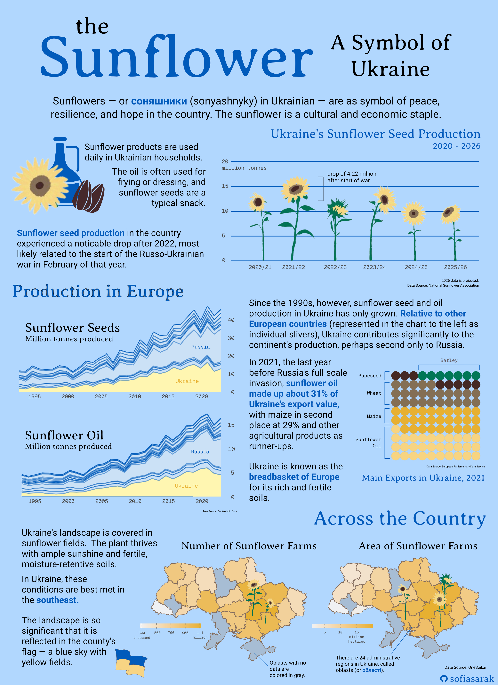
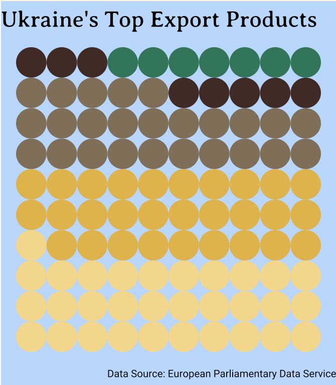

## Sunflowers as a Symbol of Peace, Resilience, and Hope

When considering what themes to center my infographic on, I knew I wanted to produce something both impactful and personal. My family is Ukrainian -- my father was born and raised in Drohobych, a city slightly south of Lviv, and my maternal grandfather grew up in the Zaporoizhia Oblast (oblasts are the administrative divisions in Ukraine, parallel to states in the U.S.), which is in the southeast of the country. 

I am first-generation American, but I spent my childhood attending Ukrainian school every Saturday (where we learned the language, culture, and history), and attending folk dance lessons as well as performing at local festivals.

```{r}
#| echo: false
#| message: false
#| out.width: "50%"
#| fig-cap: " A picture of me at about 5 years old performing in a show put on by my Ukrainian school (I'm right in the middle!)."
#| layout-ncol: 1
#| fig-alt: "Pictures of me at about 5 and 16 years of age, wearing embroidered shirts that are part of Ukrainian traditional wear."
library(here)

knitr::include_graphics(c(here("blog","ukrainian-sunflowers-infographic","images","uki_school.png")))

```


Ukrainian tradition is an integral part of my family life; reading the news on the Russo-Ukrainian War, as well as hearing about its impacts on my own relatives, has not been easy. We often hear death tolls in headlines, and I knew that I didn't want my infographic to flatten the war's impact to single numbers. Russia isn't just threatening populations, but the land, history, and traditions of an entire people. I decided that I wanted my infographic to celebrate an integral part of the Ukrainian existence: it's national flower, the sunflower.

As much as I hope that this work is informative, I also want it to serve as a reminder of Ukraine's significance as a nation and a culture. In light of the four-year anniversary of the War in Ukraine (February 24, 2026), it is important to not forget the destruction and murder that is still ongoing, no matter how removed we are from it.

## Infographic

In my piece, I wanted to answer the following question and subquestion:

**Question**: Sunflowers are a significant part of Ukrainian culture, but how important are they to and how do they emerge across the country's agricultural economy?

-   **Subquestion #1**: How has Ukraine's sunflower crop production changed over time?

-   **Subquestion #2**: How does Ukrainian sunflower oil and seed production compare to that of other European countries?

-   **Subquestion #3**: What portion of Ukrainian export value does sunflower oil make up?

-   **Subquestion #4**: How does sunflower production compare across different areas of Ukraine?

```{r}
#| eval: true
#| echo: false
#| fig-align: "center"
#| out-width: "80%"
#| fig-alt: "An example choropleth highlighting three regions of the world -- North America, Europe, and Asia -- and showing how the data can be represented in a scatterplot and barplot."

```

## The Data and the Plots

Despite being a cultural symbol, is it difficult to attain, or even conceptualize, data that could capture the sunflower's significance. Therefore, I leveraged mainly economic data relating to production and export numbers in order to highlight the plant's value, and use the infographic as a whole to further explain its role in everyday life.

All plots were created using the {ggplot2} package in R and later compiled and stylized using Affinity.

### Sunflower Seed Production Over Time

I first wanted to showcase the patterns in Ukraine's sunflower production in recent years. To do so I created a bar plot, which used data from the [National Sunflower Association](https://www.sunflowernsa.com/stats/world-supply/), which features projected data for the 2025/2026 year, as well. My base barplot is pretty basic.

```{r}
#| message: false
#| warning: false
#| echo: false

# Load necessary libraries
library(tidyverse)
library(here)
library(ggplot2)
library(janitor)
library(showtext)
library(sf)
```

```{r}
#| echo: false
#| fig-align: "center"
#|fig-alt: "Bar plot showing the change in Ukrain's sunflower production from 2021/2022 to 2025/2026. Production has been gradually decreasing since 2023/2024, with some variation before then."

# Load theme fonts
font_add_google(name = "Geist Mono", family = "geist_mono")
font_add_google(name = "Averia Serif Libre", family = "libre")
font_add_google(name = "Roboto", family = "roboto")

# Save theme colors
dark_yellow <- "#E7B030"
light_yellow <- "#f7d481"
lighter_yellow <- "#FFF6B1"
uki_blue <- "#005BBB"
light_blue <- "#cbe1f5"
platinum <- "#F0F1F3"

# Sunflower production data
sunflower_prod <- tribble(
  ~year, ~prod,
  "2020/21", 13900 * 1000,
  "2021/22", 16900 * 1000,
  "2022/23", 12680 * 1000,
  "2023/24", 15100 * 1000,
  "2024/25", 12100 * 1000,
  "2025/26", 11400 * 1000
)

showtext_auto(enable = TRUE)

sunflower_prod %>% 
  mutate(prod_millions = prod/1000000) %>% 

ggplot(aes(x = year, y = prod_millions)) +
  geom_col(width = 0.05) +
  scale_y_continuous(expand = expansion(mult = c(0, 0.3))) +
  theme_minimal(base_size = 17) +
  labs(title = "Ukraine's Sunflower Seed Production Over Time",
       # subtitle = "Production is variable, with an observed decline after the start of the\nfull-scale Russian invasion in 2022.",
       x = " ",
       y = " ",
       caption = "Data Source: National Sunflower Association") +
  theme(plot.background = element_rect(fill = "#B1D7FF"),
        panel.grid.major.x = element_blank(),
        panel.grid.minor.y = element_blank(),
        panel.grid.major.y = element_line(linewidth = 0.5, color = uki_blue),
        legend.position = "none",
        plot.title = element_text(family = "libre",
                                  size = rel(0.99),
                                  margin = margin(b = 7)),
        plot.subtitle = element_text(family = "roboto", size = rel(0.70)),
        axis.text.y = element_text(hjust = 0, family = "geist_mono", size = rel(0.85)),
        axis.text.x = element_text(family = "geist_mono", size = rel(0.85)),
        axis.title = element_text(family = "roboto", size = rel(0.7)),
        plot.caption = element_text(family = "roboto",
                                    margin = margin(t = 20),
                                    size = rel(0.45)),
        plot.caption.position = "plot")

showtext_auto(enable = FALSE)


```

To make it more impactful, I hand-drew sunflowers and overlayed them on the bars (being careful to match up heights), to represent a sunflower field. In Affinity, I then noted the drop in production between the 2021/22 and 2022/23 years, which correlates with the start of the Russo-Ukrainian war.

### Production Relative to Europe

Sunflowers are not only important to Ukraine, but the country's production is also significant in the context of the entire continent. I used agricultural information from [Our World in Data](https://ourworldindata.org/search?q=sunflower) to compare production numbers over time. I made two area plots: one for sunflower seeds and the other for sunflower oil. I used yellow to highlight Ukraine and blue for the other European countries, to both fit in with the theme but also replicate the Ukrainian flag.

```{r}
#| echo: false
#| message: false
#| fig-align: "center"
## Load sunflower production data

# create vector of only European countries
europe_countries <- c("Albania", "Andorra", "Austria", "Belarus", "Belgium", 
"Bosnia and Herzegovina", "Bulgaria", "Croatia", "Cyprus", "Czech Republic", 
"Denmark", "Estonia", "Finland", "France", "Germany", "Greece", "Hungary", 
"Iceland", "Ireland", "Italy", "Kazakhstan", "Kosovo", "Latvia", 
"Liechtenstein", "Lithuania", "Luxembourg", "Malta", "Moldova", 
"Monaco", "Montenegro", "Netherlands", "North Macedonia", "Norway", 
"Poland", "Portugal", "Romania", "Russia", "San Marino", "Serbia", 
"Slovakia", "Slovenia", "Spain", "Sweden", "Switzerland", "Turkey", 
"Ukraine", "United Kingdom", "Vatican City")

# sunflower oil
sunflower_oil <- read_csv(here("blog", "ukrainian-sunflowers-infographic", "data", "production-of-sunflower-oil", "production-of-sunflower-oil.csv")) %>% 
  clean_names() %>% 
   filter(entity %in% europe_countries) %>% 
  
  # Add a column to denote when the observation is for Ukraine
  mutate(is_ua = case_when(
    entity == "Ukraine" ~ 1,
    TRUE ~ 0
  ))

# sunflower seeds
sunflower_seeds <- read_csv(here("blog", "ukrainian-sunflowers-infographic","data", "sunflower-seed-production.csv")) %>% 
  clean_names() %>% 
   filter(entity %in% europe_countries) %>% 
  
  # Add a column to denote when the observation is for Ukraine
  mutate(is_ua = case_when(
    entity == "Ukraine" ~ 1,
    TRUE ~ 0
  ))

```

```{r}
#| echo: false
#| fig-align: "center"
#| fig-asp: 0.6
#| fig-alt: "Area chart showing sunflower oil production in tonnes from 1992 to 2022, with Ukraine contributing about the third of production in Europe by 2022."
# avoid exponential notation in y-axis
options(scipen = 999)

showtext_auto(enable = TRUE)

sunflower_seeds %>% 
  
   # create column with production tonnes scaled to be in millions
  mutate(sunflower_seed_prod_mil_tonnes = sunflower_seeds_production_tonnes/1000000) %>% 

    filter(year > 1992) %>% 
  ggplot(aes(x = year, y = sunflower_seed_prod_mil_tonnes, group = entity, 
             fill = as.factor(is_ua))) +
  geom_area(color = alpha(uki_blue, alpha = 0.5), linewidth = 0.5) +
  labs(x = " ",
       # title = "Sunflower Oil",
       y = "Tonnes Produced (in millions)",
       # subtitle = "<b><span style='color:#FFF6B1;'>Production in Ukraine</span></b> has surged since 1995, with output being comparable<br>only to Russia's.",
       caption = "Data Source: Our World in Data") +
  theme_minimal(base_size = 17) +
  scale_fill_manual(values = c(light_blue, lighter_yellow)) +
  scale_y_continuous(position = "right", expand = c(0,0)) +
  annotate("text", x = 2018, y = 6, label = "Ukraine", size = 6, color = light_yellow, 
           family = "geist_mono") +
  annotate("text", x = 2020, y = 25, label = "Russia", size = 5.5, color = uki_blue,
           family = "geist_mono") +
  annotate("text", x = 1999, y = 30, label = "Sunflower Seeds", size = 8, family = "libre") +
  theme(plot.background = element_rect(fill = "#B1D7FF"),
    panel.grid = element_blank(),
        legend.position = "none",
        plot.title = element_text(family = "libre",
                                  size = rel(0.99),
                                  margin = margin(b = 7)),
        plot.subtitle = ggtext::element_markdown(family = "roboto", size = rel(0.70)),
        axis.text.y.right = element_text(family = "geist_mono", size = rel(0.85), margin = margin(l = -15)),
        axis.text.x = element_text(family = "geist_mono", size = rel(0.85)),
        plot.caption = element_text(family = "roboto",
                                    margin = margin(t = 5),
                                    size = rel(0.45)),
        plot.caption.position = "plot",
        axis.title.y.right = element_text(family = "roboto", size = rel(0.60), margin = margin(l = 15))) +
        # panel.grid.minor.y = element_line(color = alpha("gray50", 0.5))) +
   scale_x_continuous(breaks = c(1995, 2000, 2005, 2010, 2015, 2020))

showtext_auto(enable = FALSE)
```

```{r}
#| echo: false
#| fig-align: "center"
#| fig-asp: 0.6
#| fig-alt: "Area chart showing sunflower oil production in tonnes from 1992 to 2022, with Ukraine contributing about the third of production in Europe by 2022."
# avoid exponential notation in y-axis
options(scipen = 999)

showtext_auto(enable = TRUE)

sunflower_oil %>% 
  
  # create column with production tonnes scaled to be in millions
  mutate(sunflower_oil_prod_mil_tonnes = sunflower_oil_production_tonnes/1000000) %>% 
  
  # create plot
    filter(year > 1992) %>% 
  ggplot(aes(x = year, y = sunflower_oil_prod_mil_tonnes, group = entity, 
             fill = as.factor(is_ua))) +
  geom_area(color = alpha(uki_blue, alpha = 0.5), linewidth = 0.5) +
  labs(x = " ",
       # title = "Sunflower Oil",
       y = "Tonnes Produced (in millions)",
       # subtitle = "<b><span style='color:#FFF6B1;'>Production in Ukraine</span></b> has surged since 1995, with output being comparable<br>only to Russia's.",
       caption = "Data Source: Our World in Data") +
  theme_minimal(base_size = 17) +
  scale_fill_manual(values = c(light_blue, lighter_yellow)) +
  scale_y_continuous(position = "right", expand = c(0,0)) +
  annotate("text", x = 2017, y = 2.3, label = "Ukraine", size = 6, color = light_yellow, 
           family = "geist_mono") +
  annotate("text", x = 2019, y = 9.5, label = "Russia", size = 5.5, color = uki_blue,
           family = "geist_mono") +
  annotate("text", x = 1999, y = 13, label = "Sunflower Oil", size = 8, family = "libre") +
  theme(plot.background = element_rect(fill = "#B1D7FF"),
    panel.grid = element_blank(),
        legend.position = "none",
        plot.title = element_text(family = "libre",
                                  size = rel(0.99),
                                  margin = margin(b = 7)),
        plot.subtitle = ggtext::element_markdown(family = "roboto", size = rel(0.70)),
        axis.text.y.right = element_text(family = "geist_mono", size = rel(0.8), margin = margin(l = -15)),
        axis.text.x = element_text(family = "geist_mono", size = rel(0.8)),
        plot.caption = element_text(family = "roboto",
                                    margin = margin(t = 5),
                                    size = rel(0.45)),
        plot.caption.position = "plot",
        axis.title.y.right = element_text(family = "roboto", size = rel(0.60), margin = margin(l = 15))) +
        # panel.grid.minor.y = element_line(color = alpha("gray50", 0.5))) +
   scale_x_continuous(breaks = c(1995, 2000, 2005, 2010, 2015, 2020))

showtext_auto(enable = FALSE)
```

In terms of a legend, I opted to only label Ukraine and Russia, as those are the two more eye-catching parts of the plot. The comparison between them and also the rest of the countries in Europe is all I need to deliver my message: Ukraine's sunflower production is impactful.

### Sunflower Oil as an Export in Ukraine

Having both explored the pattern of production as well as it relative to the Europe, I felt it was important to also highlight the portion of Ukraine's own economy that depends on sunflowers. Extracting 2021 data from the [European Parliament's briefing on Ukrainian agriculture](https://www.europarl.europa.eu/RegData/etudes/BRIE/2024/760432/EPRS_BRI\(2024\)760432_EN.pdf#), I created a waffle chart as a way to visualize the proportions between different agricultural exports (which the report classifies as Ukraine's "main exports".

In Affinity, I ended up labeling each segment with a bracket instead of using the {ggplot2} legend function, for better readability. Additionally, this is the one part of my plot where colorblindness may have an affect on interpretability, so this labeling method makes it more accessible.

```{r}
#| eval: true
#| echo: false
#| fig-align: "center"
#| out-width: "40%"
#| fig-alt: "Waffle chart showing that about a third of Ukrain'e export value is made up by sunflower oil, and an additional 29% by maize."



# hello! you found my source code! 
# are you wondering why this plot is embedded as an image, while the others run as code?
# the answer is that, for a reason I cannot figure out, the subsequent plots would output with white borders on either side -- I didn't like the look of them, and I could not get rid of them!
# so image it is :) see the complete code chunk at the end of the blog post for complete plot code!
```


### Sunflower Fields Across the Country

I wanted to tie sunflowers back to the Ukrainian landscape. Using predicted data from [OneSoil.ai](https://map.onesoil.ai/2020/UKR#4.24/47.26/34.38), I was able to attain oblast-level information on the size and number of sunflower fields. I plotted this spatially, using a basemap from this [GitHub repository](https://github.com/EugeneBorshch/ukraine_geojson) and joining by oblast name. The choropleth maps revealed that sunflowers are mostly grown in the southeast of the country.

Ideally, I would have preferred to use data from [Qadar et al. (2024)](https://www.sciencedirect.com/science/article/pii/S2666017224000233?), which has more granular and perhaps more accurate data, but it was not publicly accesible.

```{r}
#| echo: false
#| fig-show: hold
#| layout-ncol: 2
#| warning: false
#| message: false
#|fig-alt: "Map of Ukraine with oblasts colored by the number of sunflower farms. There tend to be more sunflower farms in southeast Ukraine, possibly due to warmer climate."

knitr::include_graphics(c("images/map_number.png", "images/map_size.png")) 

# hello! you found my source code! 
# are you wondering why this plot is embedded as an image, while the others run as code?
# the answer is that, for a reason I cannot figure out, the subsequent plots would output with white borders on either side -- I didn't like the look of them, and I could not get rid of them!
# so image it is :) see the complete code chunk at the end of the blog post for complete plot code!
```


For the units, I chose to make adjustments in Affinity as opposed to including them in the original legend. If I were to keep this figure on its own, I would most likley revert the colorbar back to vertical and have it be on the right side of the map, and include units there.

## Putting it Together

Though it was not initially my intention, my inforgraphic's flow relies heavily on being read from top to bottom. I had a lot to say in terms of contextualization, and I preferred to do so in block tests alongside the plots, instead of with annotations.

### Color Palette and Typeface

When initially envisioning this infographic, I knew I wanted it to be full of blues and yellows, in line with colors of the Ukrainian flag. Since sunflowers themselves are yellow, it made sense to make most of the actual plots yellow (especially the two choropleth maps), which led to pick blue for the background.

In terms of typeface, I used Averia Serif Libre for the titles and headings, Roboto for body text, and Geist Mono for plot details like axis labels. I ended on this selection of typefaces because they felt both academic but not too serious, which coincides with the purpose of my infographic: to educate on as well as celebrate sunflowers in Ukraine.

### Accessibility and DEIJ

My infographic color palette is almost entirely colorblind-friendly. The only exception is the waffle chart, with its greens and browns, but because I labelled each section direction, that will hopefully assist with readability.

## Complete Code

Open up this code chunk to see the code used to create each element of the final infographic!

```{r}
#| code-fold: true
#| eval: false
#| echo: true
#| message: false
#| warning: true

 #.........................Initial Set-Up.........................

# Load necessary libraries
library(tidyverse)
library(here)
library(ggplot2)
library(janitor)
library(showtext)
library(sf)

# Load necessary libraries

# Load theme fonts from Google Fonts
font_add_google(name = "Geist Mono", family = "geist_mono")
font_add_google(name = "Averia Serif Libre", family = "libre")
font_add_google(name = "Roboto", family = "roboto")

# Save theme colors
dark_yellow <- "#E7B030"
light_yellow <- "#f7d481"
lighter_yellow <- "#FFF6B1"
uki_blue <- "#005BBB"
light_blue <- "#cbe1f5"
platinum <- "#F0F1F3"

##~~~~~~~~~~~~~~~~~~~~~~~~~~~~~~~~~~~~~~~~~~~~~~~~~~~~~~~~~~~~~~~~~~
##  ~ Ukraine's Sunflower Seed Production Over Time (Bar Plot)  ----
##~~~~~~~~~~~~~~~~~~~~~~~~~~~~~~~~~~~~~~~~~~~~~~~~~~~~~~~~~~~~~~~~~~

 #..........................Load in Data..........................

# Create data frame from the National Sunflower Association webpage
sunflower_prod <- tribble(
  ~year, ~prod,
  "2020/21", 13900 * 1000,
  "2021/22", 16900 * 1000,
  "2022/23", 12680 * 1000,
  "2023/24", 15100 * 1000,
  "2024/25", 12100 * 1000,
  "2025/26", 11400 * 1000
)

 #............................Bar Plot............................

# This line of code -- used in every subsequent plot -- enables imported fonts
showtext_auto(enable = TRUE)

# Manipulate data
sunflower_prod %>% 
  
  # Scale productivity values to be in millions
  mutate(prod_millions = prod/1000000) %>% 

# Initiate plot
ggplot(aes(x = year, y = prod_millions)) +
  
  # Make bars thinner, for easier sunflower overlay
  geom_col(width = 0.05) +
  
  # Alter space between y-axis and values
  scale_y_continuous(expand = expansion(mult = c(0, 0.3))) +
  
  # Add minimal theme and set base size
  theme_minimal(base_size = 17) +
  
  # Add titles
  labs(title = "Ukraine's Sunflower Seed Production Over Time",
       # subtitle = "Production is variable, with an observed decline after the start of the\nfull-scale Russian invasion in 2022.",
       x = " ",
       y = " ",
       caption = "Data Source: National Sunflower Association") +
  
  # Theme specifications
  theme(
    # Blue backgound
    plot.background = element_rect(fill = "#B1D7FF"),
    
    # Remove vertical panel grid lines, as well as minor horizontal grid lines
        panel.grid.major.x = element_blank(),
        panel.grid.minor.y = element_blank(),
        panel.grid.major.y = element_line(linewidth = 0.5, color = uki_blue),
    
    # Plot text specifications, including font, size, and margins
        plot.title = element_text(family = "libre",
                                  size = rel(0.99),
                                  margin = margin(b = 7)),
        plot.subtitle = element_text(family = "roboto", 
                                     size = rel(0.70)),
        axis.text.y = element_text(hjust = 0, 
                                   family = "geist_mono", 
                                   size = rel(0.85)),
        axis.text.x = element_text(family = "geist_mono", 
                                   size = rel(0.85)),
        axis.title = element_text(family = "roboto", 
                                  size = rel(0.7)),
        plot.caption = element_text(family = "roboto",
                                    margin = margin(t = 20),
                                    size = rel(0.45)),
        plot.caption.position = "plot")


# This line of code -- used in every subsequent plot -- disables imported fonts
showtext_auto(enable = FALSE)

##~~~~~~~~~~~~~~~~~~~~~~~~~~~~~~~~~~~~~~~~~~~~~~~~~~~~~~~~~~~~~~
##  ~ Sunflower Production Relative to Europe (Area Chart)  ----
##~~~~~~~~~~~~~~~~~~~~~~~~~~~~~~~~~~~~~~~~~~~~~~~~~~~~~~~~~~~~~~

 #..........................Load in Data..........................

# Create vector of only European countries, because Our World in Data contains all
europe_countries <- c("Albania", "Andorra", "Austria", "Belarus", "Belgium", 
"Bosnia and Herzegovina", "Bulgaria", "Croatia", "Cyprus", "Czech Republic", 
"Denmark", "Estonia", "Finland", "France", "Germany", "Greece", "Hungary", 
"Iceland", "Ireland", "Italy", "Kazakhstan", "Kosovo", "Latvia", 
"Liechtenstein", "Lithuania", "Luxembourg", "Malta", "Moldova", 
"Monaco", "Montenegro", "Netherlands", "North Macedonia", "Norway", 
"Poland", "Portugal", "Romania", "Russia", "San Marino", "Serbia", 
"Slovakia", "Slovenia", "Spain", "Sweden", "Switzerland", "Turkey", 
"Ukraine", "United Kingdom", "Vatican City")

# Read in sunflower oil data
sunflower_oil <- read_csv(here("blog", "ukrainian-sunflowers-infographic", "data", "production-of-sunflower-oil", "production-of-sunflower-oil.csv")) %>% 
  clean_names() %>% 
  
  # Filter for only European countries
   filter(entity %in% europe_countries) %>% 
  
  # Add a column to denote when the observation is for Ukraine
  mutate(is_ua = case_when(
    entity == "Ukraine" ~ 1,
    TRUE ~ 0)) %>% 
  
  # Create column with production tonnes scaled to be in millions
  mutate(sunflower_oil_prod_mil_tonnes = sunflower_oil_production_tonnes/1000000) %>% 
  
  # Keep data only from 1992 (that is when data from Ukraine begind)
  filter(year > 1992) 

# Read in sunflower seed data
sunflower_seeds <- read_csv(here("blog", "ukrainian-sunflowers-infographic","data", "sunflower-seed-production.csv")) %>% 
  clean_names() %>% 
  
  # Filter for only European countries
   filter(entity %in% europe_countries) %>% 
  
  # Add a column to denote when the observation is for Ukraine
  mutate(is_ua = case_when(
    entity == "Ukraine" ~ 1,
    TRUE ~ 0)) %>% 
  
  # Create column with production tonnes scaled to be in millions
  mutate(sunflower_seed_prod_mil_tonnes = sunflower_seeds_production_tonnes/1000000) %>% 

  # Filter for years where there is data for Ukraine
    filter(year > 1992)


 #..................Area Chart: Sunflower Seeds...................


sunflower_seeds %>% 
  
# Initialize plot
  ggplot(aes(x = year, y = sunflower_seed_prod_mil_tonnes, group = entity, 
             
             # Fill by whether country is Ukraine or not
             fill = as.factor(is_ua))) +
  
  geom_area(color = alpha(uki_blue, alpha = 0.5), linewidth = 0.5) +
  
  # Add plot text
  labs(x = " ",
       # title = "Sunflower Oil",
       y = "Tonnes Produced (in millions)",
       # subtitle = "<b><span style='color:#FFF6B1;'>Production in Ukraine</span></b> has surged since 1995, with output being comparable<br>only to Russia's.",
       caption = "Data Source: Our World in Data") +
  
  # Set minimal theme and base size
  theme_minimal(base_size = 17) +
  
   # Add specific colors: yellow for when the country is Ukraine, blue for all others
  scale_fill_manual(values = c(light_blue, lighter_yellow)) +
  
  # Place y-axis on right side, and remove space between axis and text
  scale_y_continuous(position = "right", expand = c(0,0)) +
  
   # Add area labels for Ukraine and russia
  annotate("text", x = 2018, y = 6, 
           label = "Ukraine", 
           size = 6, color = light_yellow, 
           family = "geist_mono") +
  annotate("text", x = 2020, y = 25, 
           label = "Russia", 
           size = 5.5, color = uki_blue,
           family = "geist_mono") +
  
  # Add plot title as annotation
  annotate("text", x = 1999, y = 30, label = "Sunflower Seeds", size = 8, family = "libre") +
  
  # Set theme specifications
  theme(
    # Blue background
    plot.background = element_rect(fill = "#B1D7FF"),
    panel.grid = element_blank(),
    
    # Remove legend
        legend.position = "none",
    
    # Add text specifications, including font, size, and margin sizes
        plot.title = element_text(family = "libre",
                                  size = rel(0.99),
                                  margin = margin(b = 7)),
        plot.subtitle = ggtext::element_markdown(family = "roboto", size = rel(0.70)),
        axis.text.y.right = element_text(family = "geist_mono", size = rel(0.85), margin = margin(l = -15)),
        axis.text.x = element_text(family = "geist_mono", size = rel(0.85)),
        plot.caption = element_text(family = "roboto",
                                    margin = margin(t = 5),
                                    size = rel(0.45)),
        plot.caption.position = "plot",
        
    # Use specific argument for y-axis labels on the RIGHT 
    axis.title.y.right = element_text(family = "roboto", size = rel(0.60), margin = margin(l = 15))) +
        # panel.grid.minor.y = element_line(color = alpha("gray50", 0.5))) +
   
   # Set x-axis incremenents to be every 5 years
  scale_x_continuous(breaks = c(1995, 2000, 2005, 2010, 2015, 2020))

showtext_auto(enable = FALSE)

 #....................Area Chart: Sunflower Oil...................


showtext_auto(enable = TRUE)

sunflower_oil %>% 
  
# Initialize plot

  ggplot(aes(x = year, y = sunflower_oil_prod_mil_tonnes, 
             group = entity, 
             
             # Fill by whether the country is Ukraine or not
             fill = as.factor(is_ua))) +
  
  geom_area(color = alpha(uki_blue, alpha = 0.5), linewidth = 0.5) +
  
  # Add plot text
  labs(x = " ",
       y = "Tonnes Produced (in millions)",
       # subtitle = "<b><span style='color:#FFF6B1;'>Production in Ukraine</span></b> has surged since 1995, with output being comparable<br>only to Russia's.",
       caption = "Data Source: Our World in Data") +
  
  # Add minimal theme and set base size
  theme_minimal(base_size = 17) +
  
  # Add specific colors: yellow for when the country is Ukraine, blue for all others
  scale_fill_manual(values = c(light_blue, lighter_yellow)) +
  
  # Place y-axis on right side, and remove space between axis and text
  scale_y_continuous(position = "right", expand = c(0,0)) +
  
  # Add area labels for Ukraine and russia
  annotate("text", x = 2017, y = 2.3, 
           label = "Ukraine", 
           size = 6, color = light_yellow, 
           family = "geist_mono") +
  annotate("text", x = 2019, y = 9.5, 
           label = "Russia", 
           size = 5.5, color = uki_blue,
           family = "geist_mono") +
  
  # Add plot title as annotation
  annotate("text", x = 1999, y = 13, label = "Sunflower Oil", size = 8, family = "libre") +
  
  # Theme specifications
  theme(
    
    # Blue background
    plot.background = element_rect(fill = "#B1D7FF"),
        
    # Remove legend
    legend.position = "none",
    
    # Add text specifications, including font, size, and margin sizes
        plot.title = element_text(family = "libre",
                                  size = rel(0.99),
                                  margin = margin(b = 7)),
        #plot.subtitle = ggtext::element_markdown(family = "roboto", size = rel(0.70)),
        axis.text.y.right = element_text(family = "geist_mono", 
                                         size = rel(0.8), 
                                         margin = margin(l = -15)),
        axis.text.x = element_text(family = "geist_mono", 
                                   size = rel(0.8)),
   
     # Use specific argument for y-axis labels on the RIGHT 
        axis.title.y.right = element_text(family = "roboto", size = rel(0.60), margin = margin(l = 15)),
        plot.caption = element_text(family = "roboto",
                                    margin = margin(t = 5),
                                    size = rel(0.45)),
        plot.caption.position = "plot") +
       
  # Set x-axis incremenents to be every 5 years
   scale_x_continuous(breaks = c(1995, 2000, 2005, 2010, 2015, 2020))

showtext_auto(enable = FALSE)

##~~~~~~~~~~~~~~~~~~~~~~~~~~~~~~~~~~~~~~~~~~~~~~~
##  ~ Ukraine's Main Exports (Waffle Chart)  ----
##~~~~~~~~~~~~~~~~~~~~~~~~~~~~~~~~~~~~~~~~~~~~~~~

 #..........................Load in Data..........................

# Ukraine's agriculture data (2021), extracted from European Parliament report
uki_agri_2021 <- tribble(
  ~export, ,~value,
  "Sunflower Oil", 6400000000,
  "Maize", 5900000000,
  "Wheat", 5100000000,
  "Rapeseed", 1700000000,
  "Barley", 1300000000)


# Data wrangling
uki_agri_2021 <- uki_agri_2021 %>% 
  
  # Create columns for value in billions, as well as fraction of whole
  mutate(value_billions = value/100000000,
         fraction = value_billions/(sum(value_billions)),
         
         # Create number of squares variable (for waffle chart)
         n_squares = floor(fraction * 100),
         
         # Calculate remainder of round
         remainder = (fraction * 100) - floor(fraction * 100),
         
         # Create row number column based on fraction
         if_else(row_number() <= 100 - sum(floor(fraction * 100)), 1L, 0L)) 

  # Arrange descending by remainder
  arrange(desc(remainder)) %>%
    
  # Refactor the levels
  mutate(export = factor(export, levels = c("Sunflower Oil", "Maize", "Wheat", "Rapeseed", "Barley"))) %>% 
  
  # And force level order
  arrange(export)

# Create color scheme for each export
exports <- c("Sunflower Oil" = alpha(light_yellow, 1),
             "Maize" = alpha(dark_yellow,1),
             "Wheat" = alpha("#846E54",1),
             "Rapeseed" = alpha("#442824", 1),
             "Barley" = alpha("#007756", 1))

 #..........................Waffle Chart..........................


# Initialize plot
ggplot(uki_agri_2021, aes(fill = reorder(export, -value_billions), # Fill by value
                          values = n_squares)) +
  
  # Create waffle chart using {waffle} package
  waffle::geom_waffle(n_rows = 10, 
                      radius = unit(0.5, "npc"), size = 0, # Specify radius to make boxes into circles
                      flip = TRUE, make_proportional = FALSE) +
  # Add chart text
  labs(fill = " ",
       title = "Ukraine's Top Export Products",
       #subtitle = "Sunflower oil was the highest-valued export at $6.4 billion.",
       caption = "Data Source: European Parliamentary Data Service") +
  
  # Ensures that the box/circle size is equal
  coord_equal() +
  
  # Add minimal theme and set base size
  theme_void(base_size = 17) +
  
  # Theme specifications
  theme(
    
    # Blue backgound
    plot.background = element_rect(fill = "#B1D7FF"),
    
    # Text specifications, including font, size, and margins
        plot.title = element_text(family = "libre",
                                  size = rel(0.99),
                                  margin = margin(t = 8)),
        plot.subtitle = element_text(family = "roboto", size = rel(0.70),
                                     margin = margin(t = 4)),
        legend.text = element_text(family = "geist_mono",
                                   size = rel(0.4)),
        plot.caption = element_text(family = "roboto",
                                    margin = margin(t = 2, b = 5),
                                    size = rel(0.45)),
        plot.caption.position = "plot",
        
    # Remove legend (was added via Affinity)
        legend.position = "none") +
  
  # Set export colors
  scale_discrete_manual(values = exports, aesthetics = "fill") 

##~~~~~~~~~~~~~~~~~~~~~~~~~~~~~~~~~~~~~~~~~~~~~~~~~~~~~~~~~~~~~~~~~~
##  ~ Sunflower Production Throughout Ukraine (Choropleth Map)  ----
##~~~~~~~~~~~~~~~~~~~~~~~~~~~~~~~~~~~~~~~~~~~~~~~~~~~~~~~~~~~~~~~~~~

 #..........................Load in Data..........................

# Ukraine geometry
oblasts <- read_sf(here("blog", "ukrainian-sunflowers-infographic", "data","UA_FULL_Ukraine.geojson"))

# Attributes (sunflower farm size and number), extracted from OneSoil.ai
by_region <- read_csv(here("blog","ukrainian-sunflowers-infographic", "data","by_region.csv")) %>% 
  
  # Rename column with names in English as "Region"
  mutate("name:en" = Region)

# Join the two data frames on oblast name
sunflower_region <- left_join(oblasts, by_region, by = "name:en") %>% 
  
  # Add column where number of sunflower farms is in thousands
  mutate(number_k = Number/10)

 #..................Choropleth: Number of Farms...................

showtext_auto(enable = TRUE)

# Initialize plot
ggplot(data = sunflower_region) +
  
  # Fill by number of farms 
  geom_sf(aes(fill = Number), color = "white") +
  
  # Add chart text
  labs(title = "Number of sunflower farms",
       #subtitle = "There tend to be more sunflower farms in southeast Ukraine,\npossibly due to warmer climate.",
       fill = " ",
       caption = "Data Source: OneSoil.ai") +
  
  # Legend specifications -- horizontal and on the bottom of the plot
  guides(fill = guide_colorbar(direction = "horizontal",
                               title.position = "top",
                               barheight = 0.75,
                               position = "bottom",
                               barwidth = 9)) +
  
  # Add void theme (useful for sf objects) and base size
   theme_void(base_size = 17) +

  # Set continuous scale, with high values being darker
  scale_fill_continuous(high = "#E7B030", low = platinum, 
                        
                        # NA value as translucent brown
                        na.value = alpha("#846E54", 0.25),
                        
                        # Scale in thousands
                        labels = scales::label_number(scale = 1e-2, suffix = "k")) +
  
  # Theme specifications
  theme(
    
    # Blue background
    plot.background = element_rect(fill = "#B1D7FF"),
    
        plot.margin = margin(t = 1, r = 1, b = 1, l = 1, unit = "cm"),
        
    # Text specifications, including fonts, size, and margins
    plot.title = element_text(family = "libre",
                                  size = rel(0.99),
                                  margin = margin(b = 7, t = 7)),
        plot.subtitle = element_text(family = "roboto", size = rel(0.70),
                                     margin = margin(b = 5)),
        legend.text = element_text(family = "geist_mono",
                                   size = rel(0.55)),
        plot.caption = element_text(family = "roboto",
                                    margin = margin(t = 20),
                                    size = rel(0.45)),
        plot.caption.position = "plot") 
  
  # Add no data legend, if not adding annotation using Affinity

  #annotate("rect", xmin = 38.5, xmax = 39.5, ymin = 45.6, ymax = 45.9, fill = #846E54") +
  #annotate("text", x = 38.5, y = 45.3, label = "No Data", hjust = 0, size = 3.1, family = "geist_mono")


showtext_auto(enable = FALSE)

   #....................Choropleth: Size of Farms...................


showtext_auto(enable = TRUE)

# Initialize plot
ggplot(data = sunflower_region) +
  
  geom_sf(aes(fill = Size), color = "white") +
  
  # Add plot text
  labs(title = "Size of sunflower farms in hectares",
       # subtitle = "Sunflower farms tend to cover more area in southeast Ukraine,\npossibly due to warmer climate.",
       fill = " ",
       caption = "Data Source: OneSoil.ai") +
  
  # Legend specifications -- horizontal and on the bottom of the plot
  guides(fill = guide_colorbar(direction = "horizontal",
                               title.position = "top",
                               barheight = 0.75,
                               position = "bottom",
                               barwidth = 9)) +
  
  # Add void theme and set base size
   theme_void(base_size = 17) +
  
   # Set continuous scale, with high values being darker
  scale_fill_continuous(high = "#E7B030", low = platinum, 
                        
                        # Set color oblasts with no available data
                        na.value = alpha("#846E54", 0.25),
                        
                        # Set label scale
                        labels = scales::label_number(scale = 1e-5, suffix = " ")) +
  
  theme(
    # Blue background and margins
    plot.background = element_rect(fill = "#B1D7FF"),
        plot.margin = margin(t = 1, r = 1, b = 1, l = 1, unit = "cm"),
    
    # Text specifications, including fonts, size, and margins
        plot.title = element_text(family = "libre",
                                  size = rel(0.99),
                                  margin = margin(b = 7, t= 7)),
        plot.subtitle = element_text(family = "roboto", size = rel(0.70),
                                     margin = margin(b = 5)),
        legend.text = element_text(family = "geist_mono",
                                   size = rel(0.55)),
        plot.caption = element_text(family = "roboto",
                                    margin = margin(t = 20),
                                    size = rel(0.45)),
        plot.caption.position = "plot") 
  
  # Add no data legend, if not adding annotation using Affinity

  #annotate("rect", xmin = 38.5, xmax = 39.5, ymin = 45.6, ymax = 45.9, fill = "#cbe1f5") +
  #annotate("text", x = 38.5, y = 45.3, label = "No Data", hjust = 0, size = 3.1, family = "geist_mono")

showtext_auto(enable = FALSE)
```
