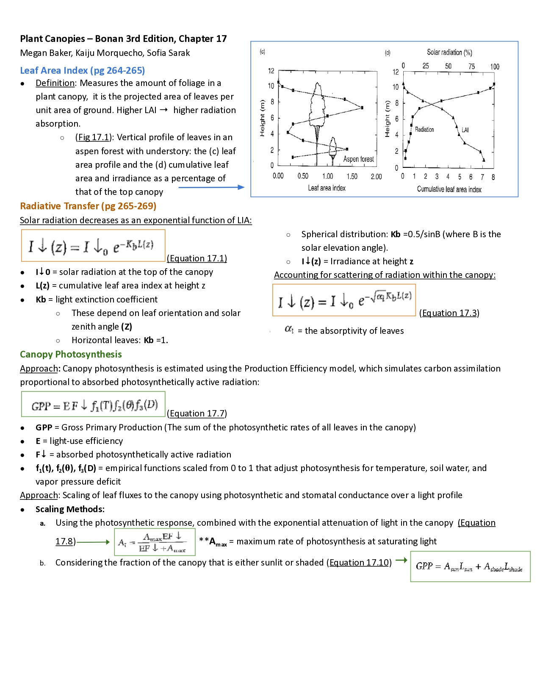
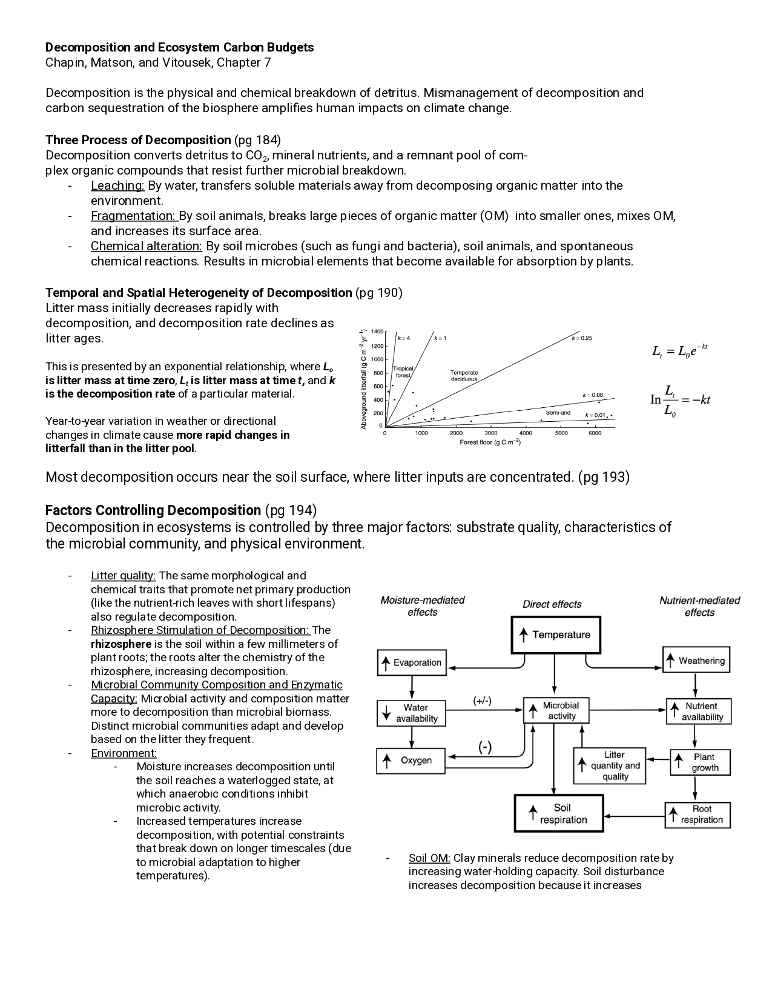

I love to learn! And since this is the last time I will be in school for a bit (most likely), I want to take advantage of it as much as I can.

My graduate program has very specific graduation requirements that are identical for everyone -- our schedules were pre-determined before we even started. Since it's a rather small program with no additional specializations, we all take the same things. In the winter, this meant taking courses in:

-   environmental modeling,

-   data Visualization and communication,

-   evaluating environmental policy,

-   and the capstone class, which gave us time and structure to work through our projects.

Although we can't deduct or replace any of the classes on the schedule, we can add as many we would like. This past quarter (Winter 2026), I took advantage of this: I enrolled in a graduate-level course in the Geography department taught by [Professor Joe McFadden](https://www.geog.ucsb.edu/people/faculty/joe-mcfadden), called Vegetation-Atmosphere Interactions (GEOG243).

I was so excited! Although I have been loving learning all things data science, I have also missed the environmental world. I have very fond memories of all the fun field trips I got to take during my undergraduate studies, and how exciting it is to understand the underlying processes of the natural world. Why a rock over here looks different than the one half a mile away, how we can determine a dinosaur's speed based on in footprints, and why coniferous forests often lack undergrowth.

GEOG243 promised weekly discussions about vegetation and atmospheric science literature. As it turns out, we read mostly textbook chapters and review papers. I got to take a break from writing code and instead pivoted back to the close reading I often had to do as an undergraduate.

Other than the readings, we were expected to work in groups to contribute two review sheets throughout the quarter -- a two-sided document that summarized the chapter we read and provided some questions for discussion. Below are the two that I worked on (you might have to zoom in) -- click for the second page!


```{=html}
<!-- I'll be honest: Claude wrote a lot of this html code. I was looking for a way to seamlessly include both pages of my review sheets, and after trying and failing at the lightbox option in Quarto, this LLM-produced version actually worked really well and seemed very customizable.-->

<!-- I don't understand all of it yet (especially not the bottom part), but I was excited that I was able to parse through some of the styling, and even incorporated breaks and bolding/italicizing all on my own! I have never been formally trained in HTML, so dipping my toes in this way, and slowly becoming more familiar, is fun! -->

<div style="width:70%; margin:0 auto">

<div style="display:flex; gap:2rem">

  <!-- Carousel A -->
  <div style="width:50%; text-align:center">
    <h3> <br> Plant Canopies</h3>
    
   <p id="carA-caption" style="text-align:center; width:100%">1 / 2</p>
   
   <p style="font-size:0.8rem"> <i> This review sheet was based on Chapter 17 (plant canopies) of <b> Ecological Climatology </b> (Bonan 2015). Megan Baker, Kaiju Morquecho, and I were all equal contributors. </i> </p>
  </div>
  


  <!-- Carousel B -->
  <div style="width:50%; text-align:center">
  <h3>Decomposition and <br> Ecosystem Carbon Budgets</h3>
    
    <p id="carB-caption" style="text-align:center; width:100%"">1 / 2</p>
    
    <p style="font-size:0.8rem"> <i> This review sheet was based on the decomposition and carbon budgets section (Chapter 7) of the textbook <b>Principles of Terrestrial Ecosystem Ecology</b> (Chapin, Matson, and Vitousek, 2011). Adam Oliphant and I were equal contributors. </i> </p>
  </div>

</div>

<script>
  const imgsA = ["images/plant_canopies_pg1.jpg", "images/plant_canopies_pg2.jpg"];
  const imgsB = ["images/decomposition_pg1.jpg", "images/decomposition_pg2.jpg"];
  const idx = {};

  function next(id, imgs) {
    idx[id] = ((idx[id] || 0) + 1) % imgs.length;
    document.getElementById(id).src = imgs[idx[id]];
    document.getElementById(id + '-caption').textContent = (idx[id]+1) + ' / ' + imgs.length;
  }
</script>

</div>
```

<br>

All in all, I really enjoyed the class. It was fun not only to step out of the world of R and Python for a bit, but also from the bubble that is the MEDS program. With only \~30 students that take *all of our classes together*, it is easy to spend days (if not weeks!) only interacting with the other MEDSies (though it is also very special).

Speaking of which, one of my favorite parts of this course actually was **meeting people outside of my department**. Yes, our discussions centered on the readings, but they were not very rigid, and oftentimes wandered to stories of people's field work stories, or Professor McFadden's personal experience with the subject. I got to interact with graduate students in the Geography department as well as other programs in the Bren School (where MEDS is housed). It prompted me to think about different fields of research, and put myself in their shoes: what would I want to study if I did a PhD? Could my interests fall under the umbrella of geography?

I am very grateful for the opportunity to take this course: to learn ecological (the soil!), physiological (plant biology!) and atmospheric (humidity, temperature, air!) concepts and meet new people. Thank you to the UCSB Department of Geography for having me!
