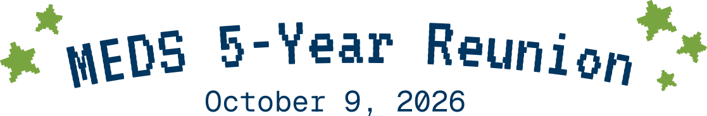
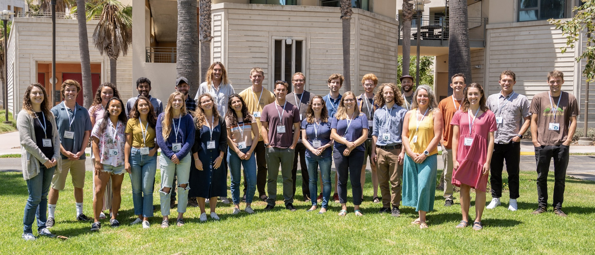
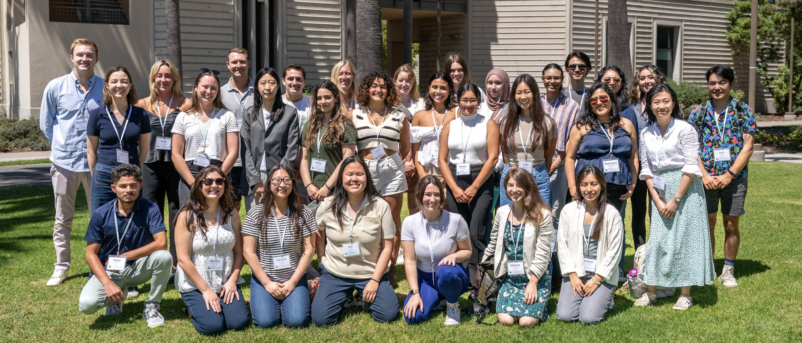
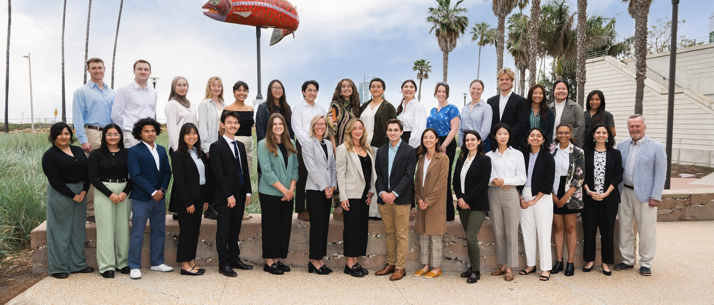
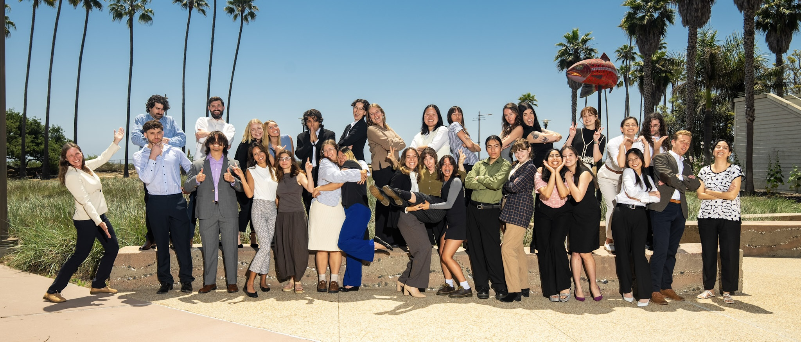
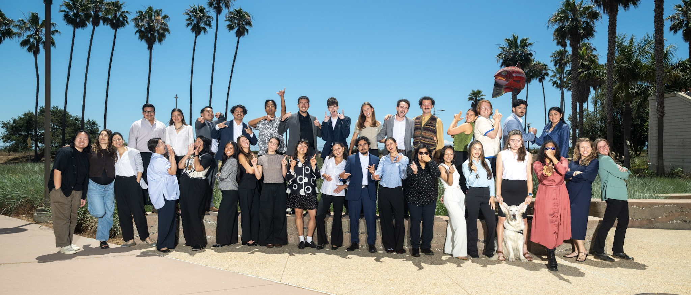

```{r}
#| eval: true
#| echo: false
#| fig-align: "center"
#| out-width: "80%"
#| fig-alt: "An infographic highlighting trends in the environmental data science job market from October 2025 through March 2026."

```

::: {.center-text}
The Bren School invites you to a reunion for the classes of 2022 through 2026 -- that's 5 years of MEDS! Join us on campus for a chance to network, reconnect with old classmates, and reminisce about your grad school days. 
:::


# Itinerary

:::: {layout-ncol=2}


::: {#first-column}


**1-2pm:** Check-in 

*location*

short description

<br>

**2-3pm:** Panel 1 

*location*

short description

<br>

**3-4pm:** Panel 2 

*location*

short description

<br>

**5-6pm:** Panel 3 

*location*

short description

<br>

**6-7pm:** Panel 4 

*location*

short description

<br>

**5-7pm:** Reception 

*location*

short description
:::
::: {#second-column}
```{r}
#| eval: true
#| echo: false
#| fig-align: "center"
#| out-width: "80%"
#| fig-alt: "An infographic highlighting trends in the environmental data science job market from October 2025 through March 2026."

```

```{r}
#| eval: true
#| echo: false
#| fig-align: "center"
#| out-width: "80%"
#| fig-alt: "An infographic highlighting trends in the environmental data science job market from October 2025 through March 2026."

```

```{r}
#| eval: true
#| echo: false
#| fig-align: "center"
#| out-width: "80%"
#| fig-alt: "An infographic highlighting trends in the environmental data science job market from October 2025 through March 2026."

```

```{r}
#| eval: true
#| echo: false
#| fig-align: "center"
#| out-width: "80%"
#| fig-alt: "An infographic highlighting trends in the environmental data science job market from October 2025 through March 2026."

```

```{r}
#| eval: true
#| echo: false
#| fig-align: "center"
#| out-width: "80%"
#| fig-alt: "An infographic highlighting trends in the environmental data science job market from October 2025 through March 2026."

```
:::

::::


# Have you RSVPed?

See who else is attending and get access to the photo album!

::: {.center-text}
[✰ Partiful ✰](https://partiful.com/e/3KTaoL1smKLlM3wmwcHB){.btn style="background-color: #79A540; color: white; font-size: 32px; padding: 20px 40px; font-family: VT323, monospace;"}
:::

```{r}
#| echo: false
# border: 2px solid #003660; (to change border color of button)
```


<div id="guest-buttons"></div>

<!-- <script> -->
<!-- fetch('guests.csv') -->
<!--   .then(res => res.text()) -->
<!--   .then(text => { -->
<!--     const rows = text.trim().split('\n').slice(1); -->
<!--     const container = document.getElementById('guest-buttons'); -->
<!--     rows.forEach(row => { -->
<!--       const [name, url] = row.split(','); -->
<!--       if (!name) return; // skip only if no name -->
<!--       const btn = document.createElement('a'); -->
<!--       btn.href = url ? url.trim() : '#'; -->
<!--       btn.textContent = name.trim(); -->
<!--       if (url) btn.target = '_blank'; -->
<!--       btn.style.cssText = 'display:inline-block;margin:4px;padding:8px 12px;background:#0077b5;color:white;border-radius:4px;text-decoration:none;'; -->
<!--       container.appendChild(btn); -->
<!--     }); -->
<!--   }); -->
<!-- </script> -->
